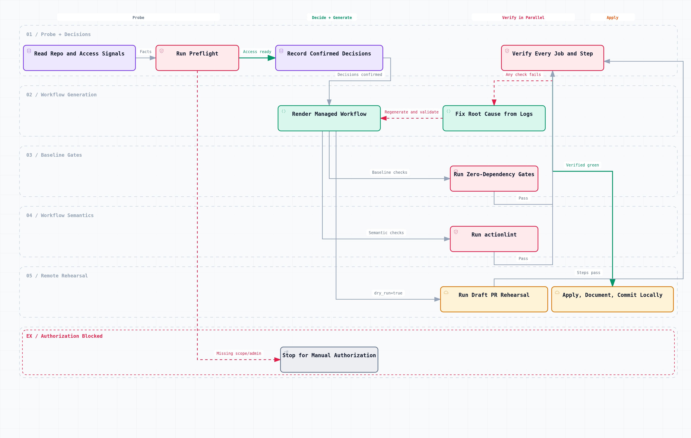

# Automated CI/CD Setup

English | [Chinese](cicd-autosetup-zh.md)

Status: active (local implementation of increments one and two is complete; remote validation in a real project remains pending)
Last updated: 2026-07-26

This document defines how the scaffold should **proactively prompt a greenfield project to set up CI/CD** and, once authorized, **complete that setup for the project's actual shape**.
This document is the design source of truth; `package.json` and `.github/workflows/` are authoritative for current commands and job behavior.

## 1. Problem to Solve

The scaffold currently provides only generic CI: a dual-OS `quality` matrix, `diagrams`, and `workflow-lint`. It has no project-specific CD: no deployment, release, or rollback workflow; no conventions for secrets or environments; and `npm test` is still a placeholder. The deployment target remains unresolved in [Open Decisions](open-decisions.md).

The solution must deliver all three of the following:

1. **Prompt at the right time:** when source code appears in a greenfield project, the mechanism should proactively say that it is time to set up CI/CD instead of waiting for someone to remember.
2. **Complete the setup:** once authorized, it should finish the setup automatically, including remote GitHub settings.
3. **Adapt to any stack:** users may work across gcc, C, C++, Python, TypeScript, and HTML, while targets may include Pages, Cloudflare, Vercel, containers, package registries, or self-hosted infrastructure, with more to come.

The confirmed CD scope is **deployment pipelines + release automation + rollback mechanisms**. Staging/production environment tiers are out of scope.

## 2. Core Decisions

### 2.1 No Template Library, but No Improvised Setup Either

The original requirement was to adapt to each project as needed instead of keeping ready-made configurations here. A CI/CD configuration actually contains two fundamentally different kinds of content:

| Category | Examples | Changes with the technology stack? |
| --- | --- | --- |
| Structural and security skeleton | Minimal `permissions`, third-party actions pinned to 40-character SHAs, `concurrency` groups, secret reference syntax, explicit `shell:` on every `run` step, a ban on `pull_request_target`, and false-green defenses | **No** — independent of language and target |
| Toolchain and commands | gcc versus clang, `cmake --build` versus `pytest`, GHCR versus PyPI, and matrix breadth | **Yes** — different for every project |

The responsibility split is therefore fixed:

- **Encode the skeleton:** the renderer hard-codes it correctly once, so every project receives the same guarantees without relying on an Agent to remember them during setup.
- **Produce toolchain details and commands in context:** the probe supplies facts, the user makes the decisions, and the result goes into the decision ledger. **No finished workflow is preinstalled in any form.**

This is neither a "technology stack × deployment target" template library—the repository will never contain a ready-made `cpp-ci.yml`—nor a model improvising YAML from scratch. The renderer guarantees syntax, permissions, and SHA pinning. Supporting a new stack requires only teaching the probe to recognize its signals, not adding another file to the repository.

### 2.2 JSON Is the Source of Truth; YAML Is an Artifact

Testing confirmed that Node v22.22.0 has no built-in YAML parser (`node:yaml` → `ERR_UNKNOWN_BUILTIN_MODULE`), while `npm run quality` promises zero third-party dependencies. The conclusion is that the generator **writes YAML but never reads it**: decisions live in a JSON ledger, and the renderer produces YAML in one direction.

This matches established repository patterns: Archify Typed JSON is the source of truth for a diagram and interactive HTML is its deterministic artifact; `contract-terms.json` is the naming source of truth and scanners only validate it.

This also provides drift detection almost for free: rerender and compare bytes. YAML and Archify HTML are generated by deterministic renderers pinned in the repository and can be checked across machines. Browser screenshots still depend on system fonts and the rendering environment, so they are not compared byte-for-byte.

### 2.3 Implement Three Core Pieces and Reuse External Engines

The core of project adaptation and workflow generation implements only the **probe, decision ledger, and renderer**. The repository also retains zero-dependency security gates, reminder hooks, a thin actionlint wrapper, and regression fixtures to constrain those three pieces. Release calculation and workflow YAML/expression semantics are not reimplemented; they use release-please and actionlint respectively:

| Capability | Choice | Rationale |
| --- | --- | --- |
| Release automation | `googleapis/release-please-action` v5.0.0, pinned in the workflow to commit `45996ed1f6d02564a971a2fa1b5860e934307cf7` | Language-neutral; `simple` supports C/C++; runs as an Action with no npm dependency in the target repository; opens a Release PR for a human to merge, preserving a manual gate |
| Workflow correctness | Official `actionlint` v1.7.12 binary, with Linux x86_64 archive SHA256 `8aca8db96f1b94770f1b0d72b6dddcb1ebb8123cb3712530b08cc387b349a3d8` | Checks YAML, expression types, runner labels, `needs` cycles, and `permissions` values; follows the independent `workflow-lint` job pattern of a pinned version, SHA256 verification, an environment variable pointing to the binary, and exclusion from `quality` |
| Build and release primitives | `aminya/setup-cpp`, `pypa/cibuildwheel`, `actions/deploy-pages`, `docker/build-push-action`, `wrangler`, and others | Official building blocks instead of custom build scripts |

The following tools are explicitly **not introduced**. Recording the reasons avoids repeating the same research later:

- **projen:** the closest precedent, but its "declare, synthesize, and enforce anti-tamper" model conflicts with this scaffold's direction of probing the current project, generating artifacts, and allowing those artifacts to evolve. It also brings 15 direct dependencies plus jsii and does not cover C/C++. Only its managed-file markers and drift-detection approach are adopted.
- **semantic-release / changesets:** deeply tied to the Node ecosystem; non-JS languages are second-class citizens.
- **goreleaser / cargo-dist:** serve Go and Rust respectively. cargo-dist's pattern of generating YAML and committing it to the repository is worth copying.
- **Dagger / Earthly:** Earthly Cloud shut down on 2025-07-16; Dagger builds are too slow without SaaS caching, and the system is orders of magnitude too heavy for a documentation-oriented scaffold.
- **act:** supports only Linux runners, which would erase the validation value of this repository's Ubuntu + Windows matrix. Its official `not_supported` list excludes OIDC and `job.environment`, so **every deploy job necessarily fails under act**. It may be mentioned only as an optional debugging tool.
- **The npm `actionlint` package:** an unofficial package whose publisher is not rhysd and whose last release was 2022-12-07. Use only the official binary.

`zizmor` was reevaluated in the second increment and still is not a standing gate. The verified-SHA256 official v1.28.0 binary was run offline against this repository with the regular persona; it exited 14 and reported eight findings, one suppressed. All seven visible high-severity findings concerned official v5 tags used by `actions/checkout` or `setup-*`. The current security skeleton already bans `pull_request_target` and malformed secret references, restricts `continue-on-error` to omission or explicit `false`, and requires third-party Actions to use 40-character SHA pins. Since v1.20.0, zizmor has required every Action—including `actions/*`—to be SHA-pinned by default, which conflicts with the established policy here that allows version tags for official GitHub Actions. Introduce it only after the project chooses to pin every Action and automate updates with Dependabot or Renovate. A non-blocking job or `continue-on-error` must not create a gate that appears to exist but does not enforce anything.

### 2.4 Probe to Select the Toolchain, Never to Guess Commands

GitLab Auto DevOps provides the lesson: its Auto Test feature was eventually removed because it could not reliably infer project test commands.

In this design, the probe emits a **fact inventory**: for example, whether `CMakeLists.txt` exists, whether `pyproject.toml` has `[project.scripts]`, whether `package.json` has a `build` script, and whether `Dockerfile` or `public/index.html` exists. Exact build and test commands **must be confirmed by the user or read from scripts already declared by the project; the generator must never invent them**. If the probe cannot establish an answer, stop and ask instead of guessing.

## 3. Overall Architecture

Data flows in exactly one direction, and every step produces verifiable output:

[Open the interactive workflow](../diagrams/cicd-autosetup-flow.archify.html) · [View the Typed JSON diagram source](../diagrams/cicd-autosetup-flow.workflow.json)

## 4. Component Responsibilities

### 4.1 Probe: `scripts/cicd/probe.mjs`

Pure Node, zero dependencies, and **read-only**. It reports facts and makes no decisions.

**Local signals:** `CMakeLists.txt`, `Makefile`, `meson.build`, `configure.ac`, `pyproject.toml` and its `[project.scripts]` / `[build-system]`, `setup.py`, `package.json` and its set of `scripts` keys, `tsconfig.json`, `Cargo.toml`, `go.mod`, `Dockerfile`, `public/index.html`, `index.html`, and the distribution of source-file extensions.

**Remote signals:** queried through `gh`, all read-only and requiring only the `repo` scope. Eight endpoints have been tested successfully: `repos/{o}/{r}` with `visibility`, `private`, `owner.type`, `permissions.admin`, `has_pages`, and `default_branch`; plus `/pages`, `/environments`, `/rulesets`, `/branches/{b}/protection`, `/actions/secrets`, `/actions/variables`, and `/actions/permissions/workflow`.

**Permission preflight:** read the token scopes from the `X-Oauth-Scopes` response header returned by `gh api -i rate_limit`. **Do not use `gh auth status` for this decision**: local testing showed that it still exits 0 after a timeout error, so it is not a reliable predicate.

The output is `.cicd/probe.json`. It is listed in `.gitignore` and is not committed because it is an environment snapshot, not a decision.

### 4.2 Decision Ledger: `docs/contracts/cicd-answers.json`

This is the **committed source of truth**. Its fields cover the generator version, a snapshot of detected facts, user-approved deployment targets, build and test commands, the workflows to generate, secret names and their sources, each target's rollback method, and a change log.

It lives in `docs/contracts/` beside the existing contract files. `check:docs` requires only `docs/**/*.md` files to appear in the documentation index, so JSON is outside that gate, but contract and secret scans still cover it.

The file also provides **zero-maintenance accumulation**: a future project of the same kind can begin from another project's ledger without maintaining a component library that will decay.

### 4.3 Renderer: `scripts/cicd/render.mjs`

The renderer maps ledger JSON to workflow YAML. Internally it uses structured JavaScript objects—an AST of jobs and steps—and a custom **restricted YAML serializer** at the boundary. The serializer needs to support only maps, sequences, strings, numbers, booleans, and the `|` block scalar, requiring roughly 100 lines of pure Node. Because every possible output is controlled, **no parser is needed**.

Each generated file begins with a managed-marker comment and a hash of the ledger content for drift detection. A Release workflow also records the previous config's SHA256, proving ownership when `release-please-config.json` is updated later.

Before writing, the renderer performs an `lstat` preflight over every target and existing residue. It rejects symlinks, non-regular files, a handwritten workflow with the same name, a config whose ownership cannot be proven, and an old managed workflow that would still trigger after removal from the ledger. All content is first written to adjacent temporary files and then replaced one file at a time with backups. Any failure restores old files in reverse order. A persistent fixture forces the second replacement to fail and asserts that all previous bytes and the file set remain unchanged. If the manifest is missing while a config or release workflow already exists, runtime state has been lost; it must be recovered and cannot be reconstructed from `initialManifest`.

The command is `npm run gen:cicd`, aligned with the existing local generator `gen:diagrams`.

### 4.4 Gate: `scripts/quality/check-cicd.mjs`

This zero-dependency gate **runs within `npm run quality`** and works at two levels:

- Regardless of whether the ledger exists, it scans `.github/workflows/` for global security red lines: no `continue-on-error` that can create a false green, no `pull_request_target`, and correctly formed secret references.
- When the ledger is absent, only ledger-driven integrity and drift checks are skipped. Any remaining managed workflow, release-please config, or manifest still fails as a missing source of truth.
- When the ledger exists, the gate validates every declared workflow and its byte-level drift, the secret inventory, each target's rollback method, and the ownership boundaries for release-please config and manifest files.
- The workflow directory, workflows, config, and manifest must all be regular files inside the repository; any symlink fails. Flow-style syntax, double-quoted escapes, or `pull_request_target` inside a block scalar in the `on` region cannot bypass the check. Neither can multiline, case-varied, expression, or alias forms of `continue-on-error`; explicit `false` remains valid. Workflows prohibit YAML aliases and anchors, explicit mapping keys, and explicit tag keys. This prevents a dangerous event from hiding in another field's block scalar and expanding later, or from rewriting a critical structure as `? on` or `!!str on`. Reuse belongs in the ledger or renderer structure, not in YAML composition semantics that a zero-dependency scanner would have to guess.
- When the ledger exists, secrets referenced by expressions in handwritten workflows must also have a registered source.
- The renderer's assembly and byte-level drift checks for managed artifacts indirectly guarantee explicit `shell:` on every `run` step. YAML, expression, and shell semantics in handwritten workflows belong to independent `actionlint` checks rather than a fabricated and incomplete set of regular-expression rules.

Because `actionlint` depends on an external binary, it runs through the separate `npm run check:workflows` command and a separate CI job. It is **not part of `quality`**.

### 4.5 Workflow Semantic Check: `scripts/quality/check-workflows.mjs`

This thin Node wrapper only locates and launches the official `actionlint`; it does not copy actionlint's rules:

- Local entry point: `ACTIONLINT_BIN=/absolute/path/actionlint npm run check:workflows`.
- If `ACTIONLINT_BIN` is not set explicitly, the wrapper tries `actionlint` from `PATH`. If it cannot be found, the command fails clearly instead of silently skipping an unavailable external tool.
- `actionlint` scans `.github/workflows/*.{yml,yaml}` and its exit code is passed through unchanged.
- The command line accepts only `.yml` or `.yaml` paths to check. It rejects actionlint options such as `-ignore` and `-shellcheck=` so temporary arguments cannot bypass repository gates. Stable configuration, such as custom runners, is reviewed and committed in `.github/actionlint.yaml`.
- Because the wrapper depends on an external binary, it is excluded from the zero-dependency, dual-OS `npm run quality` command and runs once in the independent Ubuntu `workflow-lint` job.
- CI downloads the pinned v1.7.12 Linux x86_64 archive and verifies the SHA256 above. Version comments are for readers; the checksum is the machine-enforced constraint on the downloaded artifact.
- `actionlint` checks shell scripts only when it finds `shellcheck`. CI must first assert that `shellcheck` is executable instead of treating its incidental presence on the runner as a permanent promise.
- In addition to verifying propagation of actionlint failures, positive and negative fixtures send generated Release Please workflows and boolean-`dry_run` deployment workflows through the real actionlint binary.

`check:cicd` and `actionlint` serve different purposes. The former scans every workflow for project security red lines without dependencies and checks managed artifacts for drift and integrity. The latter performs real YAML and expression semantic analysis. Neither replaces the other.

### 4.6 Generate Release Please from the Ledger

Release automation must not be committed as live configuration in an uninitialized scaffold. The renderer generates it only after a concrete project explicitly provides a `releasePlease` decision in the ledger. Its fields include at least:

- `workflowFile` and `targetBranch`;
- `credential.mode`, either `github-token` or `secret`, plus `secretName` in secret mode;
- `config`, the body of the release-please configuration, which must contain a non-empty `packages` object; the renderer validates the invariants below and supplies project-level title patterns;
- `initialManifest`, containing the current SemVer for each package path;
- `versionSources`, mapping each package path to its project version file.

The second increment accepts only the `node` and `simple` release types, for which version-file mappings have been established. `simple` supports non-Node projects such as C/C++ and Python. Any other release type first needs a corresponding primary-version-file mapping and fixture; it must not be passed through unchecked. These fields do not choose the release type, initial version, history starting point, tag rules, or version file for the project. Those remain project facts and user decisions that setup must confirm.

`config` uses a restricted field subset for the pinned Action version, and any unknown field fails validation. `include-v-in-tag` and `include-component-in-tag` must be provided explicitly. If present, `bootstrap-sha` must be a complete 40-character lowercase commit SHA. The renderer supplies English-only Release PR title patterns that follow the repository's Conventional Commit form, `<type>(<scope>): <English subject>`; the current renderer fixes the type to `chore`. Custom patterns must likewise use a valid `chore` scope form, an English subject, and the parseable `${version}` or `${branch}` placeholder. `skip-github-pull-request` is an Action input rather than manifest configuration, so any occurrence is rejected; `skip-github-release` accepts only the boolean `false`. Root-level and per-package declarations each undergo complete type, path, and `extra-files` element validation before package overrides are calculated. An override cannot hide an invalid root field that would still be written to the final configuration.

File ownership must remain separate to avoid two writers:

| File | Owner and gate |
| --- | --- |
| `docs/contracts/cicd-answers.json` | Source of truth for user decisions; stores release configuration, initial versions, version sources, and credential mode |
| `.github/workflows/<workflowFile>` | Generated deterministically by `gen:cicd`; carries a managed marker and undergoes byte-level drift checks |
| `release-please-config.json` | Generated deterministically by `gen:cicd` and checked for byte-level drift; before an update, the previous digest in the managed release workflow must prove ownership |
| `.release-please-manifest.json` | Created by `gen:cicd` only during initial bootstrap, then updated by Release PRs and never overwritten by the generator; the gate validates only package keys and SemVer values |
| `package.json`, `version.txt`, `pyproject.toml`, CMake files, and similar files | Project version sources or synchronized artifacts, as determined by the specific release type and `extra-files`; each path must be registered in the ledger and exist |

The renderer requires package keys to agree across the config, manifest, and `versionSources`. Version-source paths must be normalized, exist, be unique, and have exactly one package owner. A `node` package's `package.json` or a `simple` package's `version-file` must be registered as its primary version file, and every `extra-files` entry must also be mapped. Initial bootstrap is checked against `initialManifest`; subsequent runs are checked against the existing manifest so bootstrap values are not mistaken for runtime state. A real Release PR must still be inspected to confirm that all structured `extra-files` entries actually advance to the same version. The Release process must not be described as operational until remote acceptance is complete.

The generator creates only targets that do not exist or updates regular files it can prove that it manages. An existing handwritten workflow or config does not become generator-owned merely because it is entered in the ledger. A conflict requires either renaming the file or a user-approved backup and migration. When a workflow is renamed or removed, or Release is disabled, old artifacts block all new writes and are listed for cleanup. The generator does not delete runtime state itself.

The generated workflow is pinned to `googleapis/release-please-action@45996ed1f6d02564a971a2fa1b5860e934307cf7` (v5.0.0). It is triggered only by pushes to the target branch, has `contents: write`, `issues: write`, and `pull-requests: write` permissions, and sets `cancel-in-progress: false`. The process is:

1. A push to the target branch creates or updates a Release PR.
2. The Release PR's CI runs according to the project's credential mode and is confirmed by a person. With the default `GITHUB_TOKEN`, GitHub creates an approval-pending workflow run for a PR created or updated by the bot; someone with write permission must select **Approve workflows to run** before it can satisfy the true-green criteria.
3. A person merges the Release PR.
4. The same release workflow creates the tag and GitHub Release.

If package, image, or attachment publication is added later, it should be chained in the **same workflow** through release-please's `release_created` output. The current second increment does not generate those publication steps. Do not assume that a tag created with the default `GITHUB_TOKEN` will trigger another workflow. `github-token` adds no long-lived credential, but GitHub limits downstream workflow triggers from bot-generated events. The current renderer's `secret` mode supports a PAT and records only the secret name and source in the ledger, never the credential value. A GitHub App installation token first requires a dedicated step that creates a short-lived token and a schema for the App parameters; the current generator does not implement this, so an ordinary secret input must not be described as “GitHub App support.”

### 4.7 Three Reminder Layers

| Layer | Location | Trigger condition | Behavior |
| --- | --- | --- | --- |
| Initialization exit | `scripts/init.mjs` | Add a question by following the optional-section pattern used for the “cross-machine collaborative preview workflow” on lines 141–154 | If selected, enter the setup flow immediately. Otherwise, attach a to-do to the “deployment target” entry in [Open Decisions](open-decisions.md) and print `npm run setup:cicd` under “Next steps.” |
| Agent rules | `.claude/rules/cicd-workflow.md` + `codex-rules/rules/cicd-workflow.md` | When a technology choice is finalized, the first dependency is introduced, or a deployment-related change is added | Require the Agent to propose setup proactively and add the rule that “after pushing, the CD run must be observed until green” |
| Deterministic hook | `.claude/hooks/cicd-reminder.py`, a new standalone hook | (1) No scaffold placeholders remain, so the repository is initialized; (2) the ledger does not exist; and (3) a source-code signal has appeared | Emit a PostToolUse `additionalContext` reminder without blocking; deduplicate it with a marker file so it does not interrupt every edit |

The third layer must be a new standalone hook. The existing `post-edit-safety.py` always returns early and silently from `detect_stack` for `.md`, `.yml`, `.c`, and `.cpp` files, so extending its `CHECKS` table cannot provide this coverage.

### 4.8 Execution Component: `.claude/skills/setup-cicd/SKILL.md`

Its structure follows the existing `sync-shared-rules` workflow: read the ledger → inspect each real target → adapt through each target's mechanism → perform real verification → write back and commit locally → update the ledger. That is this repository's proven pattern for “inspection + in-context adaptation.”

The end of `SKILL.md` must define **what counts as verified**, following the [diagram system](diagram-system.md) principle that a deterministic receipt cannot replace real visual review, and provide a checkable completion list.

## 5. End-to-End Flow

**Step 0, the preflight, must run first and before any file is written.** Otherwise, setup may generate a collection of files only to discover that they cannot be pushed.

| Step | Action | Failure handling |
| --- | --- | --- |
| 0 | Permission preflight: check whether the token scope contains `workflow`, whether `permissions.admin` is true, and the repository's `visibility` and plan | If the `workflow` scope is missing, stop and guide the user to run `gh auth refresh -h github.com -s workflow`; this requires human authorization and is a mandatory pause point |
| 1 | Run the probe, emit a fact inventory, and show it to the user | If no build system can be detected, stop and ask instead of guessing |
| 2 | Confirm each item the probe cannot determine: build command, test command, deployment target, and release cadence; when Release is enabled, also confirm the release type, current version, version source, history starting point, tag rules, and credential mode | Do not generate a workflow for any item the user cannot answer yet; record it in [Open Decisions](open-decisions.md) |
| 3 | Write the ledger; store Release decisions in the optional `releasePlease` object | — |
| 4 | Render workflows and release-please configuration; bootstrap the manifest only when it does not exist | Never overwrite an existing manifest |
| 5 | Validate locally with `npm run quality` + `npm run check:workflows` | Fix every failure; skipping is not permitted |
| 6 | Use a temporary branch and draft PR for a real runner test, with deployment steps using `dry_run=true` | — |
| 7 | Assert every job and step according to the true-green criteria | On failure, retrieve logs, diagnose, fix, and push again until green |
| 8 | Apply remote settings with `gh secret set`, enable Pages, and create the environment | Record each success and every reason for skipping an item |
| 9 | Write back to the ledger, update `docs/progress.md` and `docs/progress-zh.md`, and commit locally without pushing automatically | — |

Step 6 uses a draft PR instead of `gh workflow run --ref`: **`workflow_dispatch` requires the workflow file to exist on the default branch**, otherwise the API returns 404 with a misleading error message. This repository's `ci.yml` already has an unfiltered `pull_request:` trigger, so a PR from any branch matches it. Testing confirmed that a `pull_request` event run's `headSha` is the branch head commit, allowing `gh run list -c <SHA>` to locate it unambiguously.

## 6. Design Invariants Enforced by the Renderer

| Invariant | Reason |
| --- | --- |
| Secret references always use `${{ secrets.NAME }}`, with spaces inside the braces and no surrounding quotes | **Confirmed by testing:** both `${{secrets.X}}` without spaces and `"${{ secrets.X }}"` with quotes are classified as credential leaks by this repository's `check-secrets.mjs`, making `npm run quality` fail. Fix the generator rather than weakening the scanner, which would reduce real protection. |
| Every `run` step declares `shell:` explicitly | Without it, Linux defaults to `bash -e`, with **no pipefail**, so `false \| true` passes silently. Explicit `shell: bash` enables `bash -eo pipefail`. |
| Every action outside the `actions/` organization is pinned to a 40-character SHA | This mitigates supply-chain risk and is also an explicit requirement of GitHub's `starter-workflows` contribution guidelines. |
| Every workflow has its own minimal `permissions:` block | Root-level read-only permissions are not inherited by a job that needs write access. Once any permission is declared explicitly, every undeclared permission becomes `none`. |
| `pull_request_target` is prohibited | In the context of a fork PR, it can access repository secrets and is a known credential-theft vector. |
| `continue-on-error` may be omitted or set explicitly to `false`, and nothing else | `true`, a dynamic expression, or an alias can let a job fail while the run still concludes successfully, creating a false green. |
| Deployment workflows expose a `dry_run` input, defaulting to true, that gates real publication steps; every step must be classified explicitly as `deployStep: true/false`, and at least one must be `true` | Initial verification has no side effects. A newly added unclassified step fails hard, and an existing guard cannot serve as its sentinel. This also provides both a “manual rerun as rollback entry point” and a rehearsal switch. |
| The release-please Action is pinned to a verified 40-character commit SHA | It needs repository and PR write permissions and cannot depend on a movable tag. |
| Release workflow `cancel-in-progress` is fixed to `false` | Cancellation during a release can leave tags, the Release PR, or artifacts in inconsistent states. |
| The generator never overwrites an existing `.release-please-manifest.json` | The manifest is runtime state advanced by Release PRs, not an artifact to reset from the initial ledger on every generation. |
| Evidence is retained with an artifact or log sentinel, **not** `$GITHUB_STEP_SUMMARY` | `act` discards it outright, and the API does not expose the summary directly. |

## 7. Automation Boundary: How Far Full Automation Can Go

Remote writes can be fully automated once authorized, but “fully automated” has real limits. The targets must be categorized honestly instead of pretending they are all equivalent.

**Only three target categories provide an end-to-end, single-command flow with no long-lived credential**, all GitHub-native targets with native OIDC support:

| Target | Required permissions | Manual work |
| --- | --- | --- |
| GitHub Pages | `pages: write` + `id-token: write` + `github-pages` environment | None; a local `gh api` call enables Pages once |
| GHCR / GitHub Packages | `packages: write` + `contents: read` | None; uses the default `GITHUB_TOKEN` |
| Artifact attestations | `id-token: write` + `attestations: write` | None for public repositories; private repositories require Enterprise Cloud |

**For all other targets, automation can only generate the workflow and an instruction checklist**, because a person must configure the trust relationship on the external platform:

| Target | What `gh` can do | What `gh` cannot reach and a person must do |
| --- | --- | --- |
| npm | Write a secret | Configure the Trusted Publishing organization/repository/workflow/environment binding on the npm website |
| PyPI | Write a secret | Configure the Trusted Publisher on the PyPI website |
| Cloudflare | Write a secret | There is **no OIDC support at all**, and not even an API for creating an API token; a person must generate it in the dashboard |
| Vercel | Write a secret | OIDC covers the outbound direction; inbound deployment still requires a project token |
| Cloud providers (AWS/GCP/Azure) | Write a secret | Configure the OIDC trust relationship in the provider's IAM system |

**Three hard constraints directly change which controls can be configured.** The probe must check them first and, when a constraint is not met, explicitly report that an item was “skipped because of plan, visibility, or permissions” instead of omitting it silently:

1. Local testing found token scopes of `gist, read:org, repo`, **without `workflow`**. GitHub rejects a push after `.github/workflows/*` has been written.
2. On the free plan, **private repositories do not support** environments, branch protection, rulesets, or Pages.
3. `gh` **does not provide `gh ruleset create`**; local testing found only `check`, `list`, and `view`. Rulesets, classic branch protection, environments, and Pages must therefore be enabled with `gh api --input`. Secrets must be written through stdin rather than `--body` so credentials do not enter shell history.

Two additional behavioral differences are easy to miss. For both 403 and 404 responses, `gh api` exits 1 and writes the error JSON to stdout, so decisions must parse the response body's `.status` rather than the exit code. Creating or updating a PR with the default `GITHUB_TOKEN` produces an approval-required `pull_request` run, while other commits and tags it pushes **do not trigger downstream workflows**. A “CI creates a tag → the tag triggers publication” chain therefore breaks silently.

## 8. True-Green Criteria

An exit code of 0 from `gh run watch` **does not mean** true green. Six confirmed false-green paths are: a default shell without pipefail, `startup_failure` not appearing in a `-s failure` filter, path filters preventing a run from starting at all and “no run found” being treated as non-failure, `continue-on-error`, every job being skipped, and `concurrency` cancelling the validation run.

Express the verdict as deterministic assertions:

1. Find the run by SHA and require the expected `event` and `workflowName`. **Not finding a run is failure, not success.**
2. Require `run.conclusion == "success"` and `status == "completed"`.
3. Require the entire expected set of job names to appear and each job to have `conclusion == "success"`. Treat `skipped`, `cancelled`, and `null` as failures.
4. Require the designated evidence step to exist and succeed.
5. Require either an evidence artifact or a matching log sentinel.

Wrap every `gh api` and `gh run` call in three retries with exponential backoff, and **strictly distinguish “API call failed (UNKNOWN)” from “the check concluded failure.”** Never allow missing data to pass by default. This directly implements the existing rule that completion must not be reported while CI is red or its state is unknown.

## 9. Rollback by Target, Without Promising the Impossible

Do not build a custom rollback mechanism. Use `gh` and each platform's native primitives:

| Target | Rollback method | Limitation |
| --- | --- | --- |
| GitHub Pages | Rerun the deployment run for an older commit | No native rollback; the `github-pages` environment has a concurrency lock, and a stuck run requires an API force-cancel |
| Cloudflare | `wrangler rollback` | The rollback window is 100 versions, a hard limit |
| Containers | Redeploy by immutable digest | — |
| GitHub Release | No true rollback | An older version can be marked as latest again, or a corrective version can be issued, but a downloaded tag or attachment cannot be retracted |
| **npm / PyPI package publication** | **Inherently irreversible** | Recovery requires a new version plus `deprecate` / `yank`. Documentation must say so explicitly and must not promise “rollback for every target.” |

## 10. Effort Assessment and Increment Split

**Assessment: the whole effort is large; after splitting it into two increments, the first increment is appropriately sized.**

The user is a solo developer, not a platform-engineering team. Several parts of the complete proposal fall into the category of “sounds professional but will be used fewer than three times a year,” so they were deliberately removed:

- **Remove the “component library + validated self-growth” model:** solo projects trigger it too infrequently, and the component library would quickly decay into an unmaintained dumping ground. The ledger itself already provides zero-maintenance accumulation.
- **Remove staging/production environment tiers and approval gates:** these are confirmed to be out of scope.
- **Make deep `zizmor` security audits optional:** they primarily protect against problems introduced by manually edited workflows, while the renderer never emits `pull_request_target` and hard-codes SHA pinning. The benefit in the first increment is limited.

The work is split as follows.

**First increment, implemented first and independently acceptable**

Probe + ledger + renderer + `check:cicd` + three reminder layers + `setup-cicd` Skill + `init.mjs` changes + this document and the rule files.

Acceptance criterion: complete “reminder → probe → decision → generation → local gates green → temporary-branch real-run green → remote apply” in a real greenfield project, retaining evidence of the inputs and outputs.

**Second increment**

The original design required the first increment to be used once in a real project before the second began. On 2026-07-26, the user explicitly requested that the second increment continue after the first, so this iteration completed the locally verifiable implementation. This does not mean the repository already contains remote acceptance evidence from a real greenfield project. That acceptance remains recorded separately and must not be described as complete merely because the second-increment code is complete.

Scope: an independent `actionlint` job and `npm run check:workflows`; generation of the release-please workflow and config from the ledger and project version sources; synchronized rules, Skill, quality documentation, and repeatable fixtures. `zizmor` received only an assessment of its value; the decision for this iteration is not to establish it as a standing gate.

Non-goals: do not enable a live product Release directly in the root of an uninitialized scaffold; do not preinstall a release workflow for a specific technology stack; do not publish npm/PyPI packages or images automatically; and do not create a real tag or GitHub Release without explicit authorization.

## 11. Confirmed Decisions

1. **Store the ledger at `docs/contracts/cicd-answers.json`:** it sits beside the existing contract files and follows the rule that `docs` is the source of truth.
2. **Release automation belongs to the second increment:** `release-please` introduces static configuration and a bootstrap-state manifest, and first requires a version source of truth. For C/C++, use `version.txt` and an `extra-files` annotation to synchronize `CMakeLists.txt`. A separate increment is easier to validate.
3. **Leave the `gh auth refresh -s workflow` prompt for the `setup-cicd` preflight:** do not interrupt `npm run init` with it.

## 12. First-Increment Implementation Checklist

| File | Responsibility |
| --- | --- |
| `scripts/cicd/probe.mjs` | Probe; invoked by `npm run cicd:probe`; exits nonzero when blockers exist |
| `scripts/cicd/render.mjs` | Renderer + restricted YAML serializer; invoked by `npm run gen:cicd`; fails hard on any invariant violation |
| `scripts/quality/check-cicd.mjs` | Gate included in `npm run quality`; security red lines cover every workflow, while drift detection covers only managed artifacts |
| `.claude/hooks/cicd-reminder.py` | Third reminder layer; reminds only when all three conditions match, at most once per day |
| `.claude/skills/setup-cicd/SKILL.md` | Execution component; nine-step golden workflow and acceptance checklist |
| `.claude/rules/cicd-workflow.md`, `codex-rules/rules/cicd-workflow.md` | Second reminder layer and behavioral constraints |
| `scripts/init.mjs` | First reminder layer; optional section plus a to-do recorded in `open-decisions.md` |

The second increment's local implementation and gates are complete: the independent `actionlint` job and `npm run check:workflows`; ledger-driven release-please generation; and a real `zizmor` scan whose assessment concluded that no standing gate should be added for now. A real greenfield project and its Release PR, tag, and Release still require remote acceptance after that project's version source, credential mode, and release cadence are confirmed.
