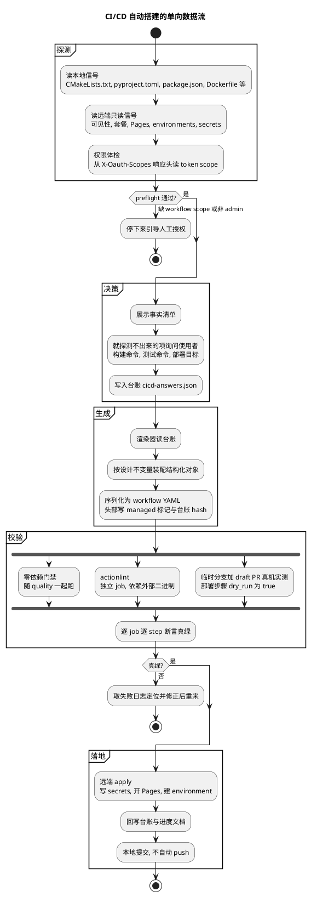
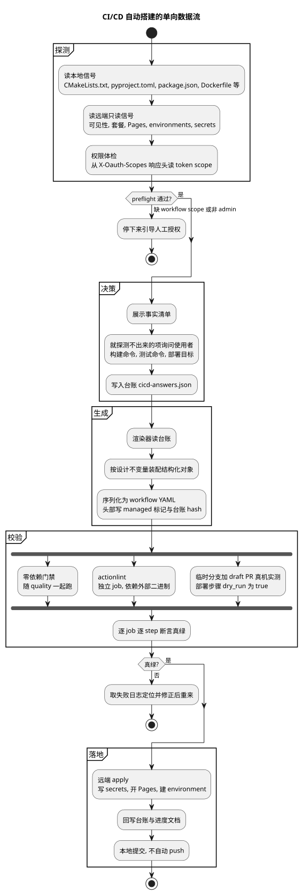

# CI/CD 自动搭建

状态：active（第一、第二增量本地实现完成；真实项目远端验收待补）
最近更新：2026-07-26

本文定义脚手架如何在绿地项目起步时**主动提醒该搭 CI/CD**，并在获得授权后**按项目实际形态自动搭完**。
本文是设计真相源；实际命令与 job 行为以 `package.json` 和 `.github/workflows/` 为准。

## 一、要解决的问题

脚手架当前只有通用 CI（`quality` 双 OS 矩阵 + `diagrams` + `workflow-lint`），没有任何
项目级 CD：没有部署、发版、回滚 workflow，没有 secrets 与环境约定，`npm test` 仍是
占位。部署目标在[待决策问题](open-decisions.md)里是未定项。

要补齐的是三件事，缺一不可：

1. **会提醒**：绿地项目长出源码时，机制主动提示"该搭 CI/CD 了"，而不是等人想起来。
2. **能搭完**：获得授权后自动完成搭建，包含远端 GitHub 设置写入。
3. **适配任意栈**：使用者的技术栈跨 gcc / C / C++ / Python / TypeScript / HTML，目标跨 Pages / Cloudflare / Vercel / 容器 / 包发布 / 自建，且未来还会增加。

CD 深度按已确认的范围：**部署流水线 + Release 自动化 + 回滚机制**。不做 staging/production 环境分层。

## 二、核心判断

### 2.1 不建模板库，但也不能纯靠现场即兴

需求原话是"按需适配对应的项目，而不是在这里建现成的"。把一份 CI/CD 配置拆开看，里面其实是两类完全不同的内容：

| 类别 | 例子 | 是否随技术栈变化 |
| --- | --- | --- |
| 结构与安全骨架 | `permissions` 最小化、第三方 action 钉 40 位 SHA、`concurrency` 分组、secrets 引用写法、每个 `run` 步骤显式 `shell:`、禁 `pull_request_target`、假绿防护 | **否** —— 与语言、目标无关 |
| 工具链与命令 | 装 gcc 还是 clang、跑 `cmake --build` 还是 `pytest`、发到 GHCR 还是 PyPI、矩阵开几档 | **是** —— 每个项目都不同 |

于是分工确定：

- **骨架代码化**：由渲染器固化，一次写对，之后每个项目都自动正确，不依赖 Agent 临场记得。
- **工具链与命令现场产生**：由探测器给事实、使用者拍板决策，写进台账，**不以任何形式预置成品 workflow**。

这既不是"技术栈 × 部署目标"的模板库（仓库里不会出现任何一份 `cpp-ci.yml` 成品），也不是纯靠模型即兴写 YAML（语法、权限、SHA 钉法由渲染器保证）。加一个新技术栈不需要往仓库加文件，只需要探测器认得它的特征。

### 2.2 真相源是 JSON，YAML 只是产物

实测 Node v22.22.0 无内置 YAML 解析器（`node:yaml` → `ERR_UNKNOWN_BUILTIN_MODULE`），而 `npm run quality` 承诺零第三方依赖。结论：生成器**只写不读 YAML**——决策存成 JSON 台账，YAML 由渲染器单向产出。

这与仓库既有范式同构：PlantUML 源码是真相源、SVG 是产物；`contract-terms.json` 是真相源、扫描只做校验。

顺带白送一个能力：漂移检测可以做成"重新渲染 + 字节比对"。这与被废弃的 `check:diagrams:fresh` 不同——YAML 序列化不依赖 JVM 字体度量，同一份 JSON 在任何机器上必然产出同样字节，跨机器稳定。

### 2.3 项目适配核心只写三块，外部引擎复用

项目适配与 workflow 生成的核心只写**探测器、台账、渲染器**；仓库仍保留零依赖安全
门禁、提醒钩子、actionlint 薄包装与回归 fixture，用来约束这三块自身。Release 计算和
workflow YAML/表达式语义检查不自研，分别复用 release-please 与 actionlint：

| 能力 | 采用 | 理由 |
| --- | --- | --- |
| Release 自动化 | `googleapis/release-please-action` v5.0.0（workflow 固定到提交 `45996ed1f6d02564a971a2fa1b5860e934307cf7`） | 语言无关，`simple` 可适配 C/C++；以 Action 运行，目标仓库零 npm 依赖，且是"先开 Release PR 待人合并"模式，保留人工闸门 |
| workflow 正确性校验 | `actionlint` v1.7.12 官方二进制（Linux x86_64 归档 SHA256 `8aca8db96f1b94770f1b0d72b6dddcb1ebb8123cb3712530b08cc387b349a3d8`） | 检查 YAML、表达式类型、runner label、`needs` 环、`permissions` 取值等；照抄现有 `diagrams` job 的"固定版本 + SHA256 + 环境变量指路径 + 不进 quality"范式 |
| 构建/发布原语 | `aminya/setup-cpp`、`pypa/cibuildwheel`、`actions/deploy-pages`、`docker/build-push-action`、`wrangler` 等 | 官方 building block，不自研构建脚本 |

明确**不引入**并记录理由，避免以后重复调研：

- **projen**：最接近的先例，但是"先声明再合成 + anti-tamper 强制不可手改"，与本脚手架"探测现状后生成、产物可被继续演进"方向相反；且 15 个直接依赖 + jsii，C/C++ 完全不在其覆盖内。只借鉴它的 managed-file 标记与漂移检测方法论。
- **semantic-release / changesets**：Node 生态深度绑定，非 JS 语言是二等公民。
- **goreleaser / cargo-dist**：分别只服务 Go / Rust。cargo-dist 的"生成 YAML 提交进仓库"工作模式值得照抄。
- **Dagger / Earthly**：Earthly Cloud 已于 2025-07-16 停服；Dagger 无 SaaS 缓存时构建慢到不值得，且对文档型脚手架数量级过重。
- **act**：只支持 linux runner，直接毁掉本仓库 ubuntu+windows 双矩阵的验证价值；官方 `not_supported` 明确不支持 OIDC 与 `job.environment`，意味着**所有 deploy job 在 act 下必然失败**。只能在文档里作为可选 debug 工具提及。
- **npm 上的 `actionlint` 包**：非官方野包（发布者非 rhysd，最后发布 2022-12-07）。只走官方二进制。

`zizmor` 在第二增量重新评估后仍不设为常驻门禁：使用校验过 SHA256 的 v1.28.0
官方二进制对当前仓库执行 regular persona 离线扫描，退出码为 14，报告 8 项（1 项
suppressed）；显示的 7 项 high 全部是 `actions/checkout` / `setup-*` 使用官方 v5 tag。
当前安全骨架已禁止
`pull_request_target`、错误 secrets 引用，并把 `continue-on-error` 限制为省略或显式
`false`，同时要求第三方 Action
钉 40 位 SHA；而 zizmor v1.20.0 起默认要求包括 `actions/*` 在内的所有 Action 都钉 SHA，
与本设计允许 GitHub 官方 Action 使用版本 tag 的既定策略冲突。等项目决定"全部 Action
钉 SHA + 用 Dependabot/Renovate 自动更新"时再引入；当前不得用 non-blocking job 或
`continue-on-error` 做一个看似存在、实际不拦截的门禁。

### 2.4 探测只用来选工具链，不用来猜命令

GitLab Auto DevOps 的教训：它的 Auto Test 功能因为"猜不准项目的测试命令"最终被弃用。

落到本设计：探测器输出的是**事实清单**（存在 `CMakeLists.txt` / `pyproject.toml` 有 `[project.scripts]` / `package.json` 有 `build` 脚本 / 有 `Dockerfile` / 有 `public/index.html`），构建与测试的具体命令**必须由使用者确认，或从项目已声明的脚本里读取，不得由生成器发明**。探不出来就停下来问，不猜。

## 三、总体架构

数据流严格单向，每一步都有可核验产物：

## 四、组件职责

### 4.1 探测器 `scripts/cicd/probe.mjs`

纯 Node、零依赖、**只读**。输出事实，不做任何决策。

**本地信号**：`CMakeLists.txt`、`Makefile`、`meson.build`、`configure.ac`、`pyproject.toml`（及其中的 `[project.scripts]` / `[build-system]`）、`setup.py`、`package.json`（及其 `scripts` 键集合）、`tsconfig.json`、`Cargo.toml`、`go.mod`、`Dockerfile`、`public/index.html`、`index.html`、源文件扩展名分布。

**远端信号**（`gh`，全部只读，仅需 `repo` scope，8 个端点已实测可用）：`repos/{o}/{r}`（`visibility` / `private` / `owner.type` / `permissions.admin` / `has_pages` / `default_branch`）、`/pages`、`/environments`、`/rulesets`、`/branches/{b}/protection`、`/actions/secrets`、`/actions/variables`、`/actions/permissions/workflow`。

**权限体检**：从 `gh api -i rate_limit` 的 `X-Oauth-Scopes` 响应头读 token scope。**不得用 `gh auth status` 判断**——本机实测它在超时报错时仍然 `exit 0`，是不可靠的判据。

产物写 `.cicd/probe.json`（加入 `.gitignore`，不入库，因为它是环境快照不是决策）。

### 4.2 台账 `docs/contracts/cicd-answers.json`

**入库的真相源**。字段：生成器版本、探测事实快照、使用者拍板的部署目标、构建与测试命令、要生成的 workflow 清单、secrets 清单与来源、每个目标的回滚方式、变更记录。

放 `docs/contracts/` 与既有契约文件同列。`check:docs` 只要求 `docs/**/*.md` 进索引，JSON 不受该门禁约束，但仍会被契约扫描与密钥扫描覆盖。

这个文件同时是**零维护成本的沉淀**：下次开同类项目可以拿另一个项目的台账当起点，不需要维护一个会腐烂的"积木库"。

### 4.3 渲染器 `scripts/cicd/render.mjs`

台账 JSON → workflow YAML。内部持有结构化 JS 对象（job / step 的 AST），末端用自写的**受限 YAML 序列化器**输出——只需覆盖 map / seq / string / number / bool / 块标量 `|`，约 100 行纯 Node。输出集合完全可控，因此**不需要解析器**。

生成物头部写 managed 标记注释 + 台账内容 hash，供漂移检测使用；Release workflow 还记录
上一份 config 的 SHA256，作为后续更新 `release-please-config.json` 时的所有权证明。

写盘先对全部目标和现有残留做 `lstat` 预检：拒绝 symlink、非普通文件、同名手写
workflow、无法证明归属的 config，以及台账移除后仍会触发的旧 managed workflow。全部
内容先写相邻临时文件，再逐文件备份替换；任一步失败就按倒序恢复旧文件，持久化夹具会在
第二个文件替换失败时断言所有旧字节和文件集合不变。manifest 缺失但 config 或 release
workflow 已存在时视为运行状态丢失，只能恢复，不能拿 `initialManifest` 重建。

命令入口 `npm run gen:cicd`，与既有 `gen:diagrams`（本地生成器）对齐。

### 4.4 门禁 `scripts/quality/check-cicd.mjs`

零依赖，**进 `npm run quality`**，分两层执行：

- 无论台账是否存在，都扫描 `.github/workflows/` 的全局安全红线：无
  可产生假绿的 `continue-on-error`、无 `pull_request_target`，secrets 引用符合书写约定。
- 台账不存在时，只跳过台账驱动的完整性与漂移检查；若残留 managed workflow、
  release-please config 或 manifest，仍按“真相源丢失”失败。
- 台账存在时，校验声明的 workflow 文件及字节漂移、secrets 清单、每个目标的回滚方式，
  以及 release-please config/manifest 的所有权边界。
- workflow 目录、workflow、config 与 manifest 都必须是仓库内普通文件，symlink 直接失败；
  flow-style、双引号转义或 `on` 区域 block scalar 中的 `pull_request_target`，以及跨行、
  大小写变化、表达式或别名形式的 `continue-on-error` 都不能绕过；显式 `false` 仍可用。
  workflow 禁止 YAML alias / anchor、显式 mapping key 与显式 tag key，避免危险事件藏在
  其他字段的 block scalar 后再展开，或用 `? on` / `!!str on` 改写关键结构；需要复用时
  在台账或渲染器结构层表达，不把 YAML 组合语义留给零依赖扫描器猜。
- 台账存在时，手写 workflow 中表达式引用的 secrets 同样必须登记来源。
- 每个 `run` 步骤显式 `shell:` 由渲染器装配和 managed 产物字节漂移间接保证；手写
  workflow 的 YAML、表达式和 shell 语义交给独立 `actionlint`，不在正则扫描器里伪造
  一套不完整的解析规则。

`actionlint` 因依赖外部二进制，走独立的 `npm run check:workflows` + 独立 CI job，**不进 `quality`**。

### 4.5 workflow 语义检查 `scripts/quality/check-workflows.mjs`

Node 薄包装只负责定位并启动官方 `actionlint`，不复制它的规则：

- 本地入口：`ACTIONLINT_BIN=/absolute/path/actionlint npm run check:workflows`。
- 未显式设置 `ACTIONLINT_BIN` 时尝试使用 `PATH` 中的 `actionlint`；找不到就明确失败，
  不因外部工具缺失而静默跳过。
- `actionlint` 扫描 `.github/workflows/*.{yml,yaml}`；退出码原样透传。
- 命令行只接受要检查的 `.yml` / `.yaml` 路径，拒绝 `-ignore`、`-shellcheck=` 等
  actionlint 选项，避免临时参数绕过仓库门禁；自定义 runner 等稳定配置写入
  `.github/actionlint.yaml` 后评审入库。
- 它依赖外部二进制，因此不加入零依赖、双 OS 的 `npm run quality`，只在 Ubuntu 的
  独立 `workflow-lint` job 运行一次。
- CI 固定下载 v1.7.12 的 Linux x86_64 归档并校验上述 SHA256；版本注释只供人阅读，
  校验和才是下载产物的机器约束。
- `actionlint` 找到 `shellcheck` 时才会检查 shell 脚本；CI 必须先确认
  `shellcheck` 可执行，不能把"runner 恰好预装"当成永久承诺。
- 正负 fixture 除了检查 actionlint 失败透传，还会把生成的 Release Please 与布尔
  `dry_run` 部署 workflow 交给真实 actionlint。

`check:cicd` 与 `actionlint` 分工不同：前者零依赖扫描全部 workflow 的项目安全红线，
并对 managed 产物做漂移和完整性校验；后者使用真实 YAML/表达式语义检查。两者不能互相替代。

### 4.6 Release Please 按台账生成

Release 自动化不能作为未初始化脚手架的活配置提交；只有具体项目在台账中显式提供
`releasePlease` 决策后，渲染器才生成它。字段至少包含：

- `workflowFile`、`targetBranch`；
- `credential.mode`（`github-token` 或 `secret`）及 secret 模式下的 `secretName`；
- 作为 release-please 配置主体的 `config`（必须含非空 `packages`；渲染器校验下述不变量
  并补项目级标题）；
- `initialManifest`（每个 package path 的当前 SemVer）；
- `versionSources`（每个 package path 对应的项目版本文件路径）。

第二增量只接受已建立版本文件映射的 `node` 与 `simple` release type；`simple` 可服务
C/C++、Python 等非 Node 项目。其他 release type 需要先补对应主版本文件映射和 fixture，
不能未经校验原样透传。这组字段不替项目选择 release type、初始版本、历史起点、tag
规则或版本文件；这些仍是 setup 阶段必须确认的项目事实与用户决定。

`config` 使用固定 Action 版本对应的受限字段子集，未知字段直接失败；必须显式写
`include-v-in-tag` 与 `include-component-in-tag`。如提供 `bootstrap-sha`，必须是完整
40 位小写提交 SHA。渲染器会补上符合仓库提交规范的双语 Release PR 标题模式；自定义
模式也必须保留 `English / 中文` 结构和可解析的 `${version}` / `${branch}` 占位符。
`skip-github-pull-request` 是 Action input 而不是 manifest config，任何值都拒绝；
`skip-github-release` 只接受布尔 `false`。根级与每个 package 的声明先分别做完整类型、
路径和 extra-files 元素校验，再计算 package override；override 不能掩盖仍会写入最终
config 的非法根字段。

文件所有权必须分开，避免两个 writer：

| 文件 | 所有者与门禁 |
| --- | --- |
| `docs/contracts/cicd-answers.json` | 使用者决策真相源；保存 release 配置、初始版本、版本源与凭证模式 |
| `.github/workflows/<workflowFile>` | `gen:cicd` 确定性生成；带 managed 标记并做字节漂移检查 |
| `release-please-config.json` | `gen:cicd` 确定性生成；做字节漂移检查，更新前必须由 managed release workflow 中的旧摘要证明归属 |
| `.release-please-manifest.json` | 仅首次 bootstrap 时由 `gen:cicd` 创建；之后由 Release PR 更新，生成器不得覆盖；门禁只校验 package key 与 SemVer |
| `package.json`、`version.txt`、`pyproject.toml`、CMake 文件等 | 项目版本源或同步产物；由具体 release type / `extra-files` 决定，路径必须在台账登记且真实存在 |

渲染器要求 config / manifest / versionSources 的 package key 一致，版本源路径规范、
存在、无重复且只有一个 package owner；`node` 的 `package.json` 或 `simple` 的
`version-file` 必须登记为主版本文件，extra-files 也必须逐项映射。首次 bootstrap 对照
`initialManifest`，之后对照现有 manifest，避免把 bootstrap 值误当运行状态。真实 Release
PR 仍要检查所有结构化 extra-files 是否实际更新到同一版本；未做远端验收前不能写成
Release 流程已经可用。

生成器只创建不存在的目标，或更新可证明由自身管理的普通文件。已有手写 workflow /
config 不会因为写入台账就自动变成生成器所有；冲突时必须改名，或由使用者确认备份与
迁移。改名、移除 workflow 或停用 Release 时，旧产物会在任何新写入前阻断并列出清理项，
生成器不会自行删除运行状态。

生成的 workflow 固定使用
`googleapis/release-please-action@45996ed1f6d02564a971a2fa1b5860e934307cf7`
（v5.0.0），只由目标分支 push 触发，权限为 `contents: write`、`issues: write`、
`pull-requests: write`，且 `cancel-in-progress: false`。流程是：

1. 目标分支 push 后创建或更新 Release PR；
2. Release PR 的 CI 按项目凭证模式运行并由人确认；使用默认 `GITHUB_TOKEN` 时，
   GitHub 会为机器人创建或更新 PR 产生待批准的 workflow run，需要有写权限的人点击
   **Approve workflows to run** 后才进入真绿判定；
3. 人工合并 Release PR；
4. 同一个 release workflow 创建 tag 与 GitHub Release。

若后续要增加包、镜像或附件发布，应使用 release-please 的 `release_created` 输出在
**同一个 workflow** 串联；当前第二增量未生成这些发布步骤。不能假设默认
`GITHUB_TOKEN` 创建的 tag 会触发另一个 workflow。
`github-token` 不新增长期凭证，但 GitHub 对机器人生成事件的后续 workflow 触发有限制。
当前渲染器的 `secret` 模式支持传入 PAT，并只在台账登记 secret 名与来源、不写凭证值；
GitHub App installation token 需要先增加生成短期 token 的专用步骤与 App 参数 schema，
当前生成器尚未实现，不能把普通 secret 输入写成“已支持 GitHub App”。

### 4.7 提醒三层

| 层 | 位置 | 判定条件 | 表现 |
| --- | --- | --- | --- |
| 初始化出口 | `scripts/init.mjs` | 照抄行 141-154"跨机协同预览工作流"的可选章节范式，新增一段询问 | 选了就直接进搭建流程；不选则往[待决策问题](open-decisions.md)的"部署目标"条目挂待办，并在"后续步骤"里打印 `npm run setup:cicd` |
| Agent 规则 | `.claude/rules/cicd-workflow.md` + `codex-rules/rules/cicd-workflow.md` | 技术选型落地、引入首个依赖、新增部署相关改动时 | 约束 Agent 主动提出搭建，并规定"推送后必须观察 CD run 转绿"扩展条款 |
| 确定性钩子 | `.claude/hooks/cicd-reminder.py`（新增独立 hook） | ①仓库无残留占位符（已初始化）②台账不存在 ③已出现源码信号 | PostToolUse 输出 `additionalContext` 提醒，**不阻断**；用标记文件去重，避免每次编辑都吵 |

第三层必须新写独立 hook：现有 `post-edit-safety.py` 对 `.md` / `.yml` / `.c` / `.cpp` 一律在 `detect_stack` 处提前返回、完全静默，扩它的 `CHECKS` 表无法覆盖。

### 4.8 执行体 `.claude/skills/setup-cicd/SKILL.md`

形状照抄既有的 `sync-shared-rules`（读台账 → 逐目标实际探查 → 按各自机制适配 → 实测校验 → 写回并本地提交 → 更新台账），它已经是本仓库验证过的"探查 + 现场适配"范式。

SKILL.md 结尾必须写明**什么才算验证通过**（照抄 `plantuml-in-markdown` 的"用户只说看起来不错不算通过"），以及可勾选的收工清单。

## 五、端到端流程

**第 0 步 preflight 必须最先跑，且在写任何文件之前**——否则会生成一堆文件后卡在推不上去。

| 步 | 动作 | 失败处理 |
| --- | --- | --- |
| 0 | 权限体检：token scope 是否含 `workflow`；`permissions.admin` 是否为真；仓库 `visibility` 与套餐 | 缺 `workflow` scope 则停下来引导 `gh auth refresh -h github.com -s workflow`（需人工授权，属于必须暂停的点） |
| 1 | 跑探测器，输出事实清单并展示给使用者 | 探测不到构建系统就停下来问，不猜 |
| 2 | 就"探测不出来的事"逐项确认：构建命令、测试命令、部署目标、发布节奏；启用 Release 时再确认 release type、当前版本、版本源、历史起点、tag 与凭证模式 | 使用者答不上来的项先不生成对应 workflow，记进[待决策问题](open-decisions.md) |
| 3 | 写台账；Release 决策写入可选 `releasePlease` | —— |
| 4 | 渲染 workflow 与 release-please config；manifest 只在不存在时 bootstrap | 已存在 manifest 时绝不覆盖 |
| 5 | 本地校验：`npm run quality` + `npm run check:workflows` | 红了就修，不许跳过 |
| 6 | 临时分支 + draft PR 触发真机实测，部署步骤走 `dry_run=true` | —— |
| 7 | 按"真绿判据"逐 job 逐 step 断言 | 失败则取日志定位 → 修 → 再推，直到转绿 |
| 8 | 远端 apply：`gh secret set` / 开 Pages / 建 environment | 逐项记录成功与跳过原因 |
| 9 | 回写台账、更新 `docs/progress.md`、本地提交（不自动 push） | —— |

第 6 步用 draft PR 而不是 `gh workflow run --ref`：**`workflow_dispatch` 要求 workflow 文件已存在于默认分支**，否则 API 返回 404 且错误文案具有误导性。而本仓库 `ci.yml` 已有裸 `pull_request:` 触发，任意分支开 PR 都会命中。实测确认 `pull_request` 事件 run 的 `headSha` 就是分支 head commit，`gh run list -c <SHA>` 可无歧义定位。

## 六、设计不变量（渲染器固化，不依赖临场记忆）

| 不变量 | 原因 |
| --- | --- |
| secrets 引用一律写成 `${{ secrets.NAME }}`（花括号内留空格、外面不加引号） | **已实测**：`${{secrets.X}}`（无空格）与 `"${{ secrets.X }}"`（带引号）都会被本仓库 `check-secrets.mjs` 判为密钥泄漏，`npm run quality` 直接红。修生成器而不是放宽扫描器——放宽会削弱真实防护 |
| 每个 `run` 步骤显式写 `shell:` | 不写时 Linux 默认是 `bash -e`（**无 pipefail**），`false \| true` 会静默通过；显式 `shell: bash` 才是 `bash -eo pipefail` |
| 非 `actions/` 组织的 action 一律钉 40 位 SHA | 供应链风险；这也是 GitHub `starter-workflows` 贡献规范的明文要求 |
| 每个 workflow 自带最小 `permissions:` 块 | 根级只读权限不会被继承到需要写的 job；显式声明任一项后，未声明项自动为 `none` |
| 禁止 `pull_request_target` | 它在 fork PR 上下文里能拿到仓库 secrets，是已知的凭证窃取入口 |
| `continue-on-error` 只能省略或显式为 `false` | `true`、动态表达式或别名都可能让 job 失败而 run 结论仍是 success，制造假绿 |
| 部署类 workflow 带 `dry_run` 输入（默认 true）gate 住真实发布步骤；每个 step 必须显式分类为 `deployStep: true/false`，且至少一个为 `true` | 首次验证零副作用；新增步骤若漏分类会硬失败，不能靠已有 guard 充当哨兵；同时提供"手动重跑即回滚入口"和"演练开关" |
| release-please Action 固定到已核验的 40 位提交 SHA | 它需要写仓库与 PR 权限，不能依赖可移动 tag |
| Release workflow 的 `cancel-in-progress` 固定为 `false` | 发版中途取消会留下 tag、Release PR 或产物状态不一致 |
| 已存在的 `.release-please-manifest.json` 不由生成器覆盖 | manifest 是 Release PR 持续更新的运行状态，不是每次从初始台账重置的生成物 |
| 用 artifact 或日志哨兵留证据，**不用** `$GITHUB_STEP_SUMMARY` | act 会直接丢弃它，且 API 不直接暴露 summary |

## 七、自动化边界：能全自动到哪里

已授权全自动远端写入，但"全自动"有真实上限，必须诚实分档而不是假装都能做。

**能做到零长期凭证、一条命令闭环的只有三类**（GitHub 自家目标，OIDC 原生）：

| 目标 | 所需 permissions | 人工活 |
| --- | --- | --- |
| GitHub Pages | `pages: write` + `id-token: write` + `github-pages` environment | 无（Pages 开启由本地 `gh api` 一次性完成） |
| GHCR / GitHub Packages | `packages: write` + `contents: read` | 无（用默认 `GITHUB_TOKEN`） |
| artifact attestations | `id-token: write` + `attestations: write` | 无（public 仓库；private 需 Enterprise Cloud） |

**其余目标只能"生成 workflow + 生成引导清单"**，因为信任关系必须由人去对方平台配：

| 目标 | gh 能做的 | gh 碰不到、必须人工的 |
| --- | --- | --- |
| npm | 写 secret | Trusted Publishing 的 org/repo/workflow/environment 绑定要在 npm 网页配 |
| PyPI | 写 secret | Trusted Publisher 要在 PyPI 网页配 |
| Cloudflare | 写 secret | **完全没有 OIDC**，且连"创建 API token"都没有 API，只能人工在面板生成 |
| Vercel | 写 secret | OIDC 是出站方向，入站部署仍需项目 token |
| 云厂商（AWS/GCP/Azure） | 写 secret | OIDC 信任关系要在对方 IAM 配 |

**三条会直接改变可配项的硬约束**，探测阶段必须先查、不满足就显式输出"因套餐/可见性/权限跳过"而不是静默不配：

1. 本机 token scope 实测为 `gist, read:org, repo`，**缺 `workflow`**——写完 `.github/workflows/*` 后 push 会被 GitHub 直接拒绝。
2. 免费计划下 **private 仓库不支持** environments / 分支保护 / rulesets / Pages。
3. `gh` **没有 `gh ruleset create`**（实测本机只有 `check` / `list` / `view`）——rulesets、classic 分支保护、environments、Pages 启用一律走 `gh api --input`，且写 secret 必须走 stdin 而非 `--body`，避免密钥进 shell history。

另有两个易踩的行为差异：`gh api` 对 403/404 一律 `exit 1` 且错误 JSON 走 stdout，判定
必须解析响应体的 `.status` 而非退出码；默认 `GITHUB_TOKEN` 创建或更新 PR 会产生
approval-required 的 `pull_request` run，其他由它推送的提交与 tag **不会触发下游
workflow**，所以“CI 自动打 tag → tag 触发发布”这条链会静默断掉。

## 八、"真绿"判据

`gh run watch` 退出 0 **不等于**真绿。已确认的假绿通道有六条：默认 shell 无 pipefail、`startup_failure` 不进 `-s failure` 过滤、路径过滤导致压根没触发（"查不到 run"被当成没失败）、`continue-on-error`、全部 job skipped、`concurrency` 把验证 run 干成 cancelled。

判定写成确定性断言：

1. 按 SHA 找到 run，且 `event` / `workflowName` 对得上——**找不到判负，不是通过**。
2. `run.conclusion == "success"` 且 `status == "completed"`。
3. 期望的 job 名集合全部出现，逐个 `conclusion == "success"`；出现 `skipped` / `cancelled` / `null` 一律判负。
4. 指定的证据 step 存在且成功。
5. artifact 证据存在，或日志哨兵命中。

所有 `gh api` / `gh run` 调用包 3 次重试 + 指数退避，并**严格区分"API 调用失败(UNKNOWN)"与"检查结论为失败"**——拿不到数据绝不默认放行。这一条直接对应既有规则"不允许在 CI 红色或状态未知时汇报任务完成"。

## 九、回滚：按目标分档，且不承诺做不到的事

不自研回滚机制，全部用 `gh` 与各平台原生原语：

| 目标 | 回滚方式 | 限制 |
| --- | --- | --- |
| GitHub Pages | 重跑旧 commit 的部署 run | 无原生 rollback；`github-pages` environment 有并发锁，卡死需 API force-cancel |
| Cloudflare | `wrangler rollback` | 可回滚版本窗口 100，是硬上限 |
| 容器 | 按 immutable digest 重新部署 | —— |
| GitHub Release | 不可真正回滚 | 可把旧版重新标为 latest 或补发修正版，但无法撤回已被下载的 tag/附件 |
| **npm / PyPI 包发布** | **本质不可回滚** | 只能发新版本 + `deprecate` / `yank`，必须在文档里写清楚，不能承诺"全目标可回滚" |

## 十、工程量判断与增量拆分

**判定：整体偏大，拆成两个增量后第一增量为"刚刚好"。**

理由：使用者是单人开发者，不是平台工程组。完整方案里有几项属于"听起来专业但一年用不到三次"，已主动砍掉：

- **砍掉"积木库 + 验证后自增长"**：单人项目触发频次低，积木库会迅速腐烂成无人维护的垃圾场。台账文件本身已经提供了零维护成本的沉淀能力。
- **砍掉 staging/production 环境分层与审批门**：已确认不在范围内。
- **`zizmor` 深度安全审计降为可选**：它主要防"人手改 workflow 后引入的问题"，而渲染器根本不生成 `pull_request_target`、SHA 钉法也是固化的，第一增量的收益有限。

拆分：

**第一增量（先做，可独立验收）**
探测器 + 台账 + 渲染器 + `check:cicd` + 三层提醒 + `setup-cicd` skill + `init.mjs` 改动 + 本文档与规则文件。
验收标准：在一个真实绿地项目上跑通"提醒 → 探测 → 拍板 → 生成 → 本地门禁绿 → 临时分支实测转绿 → 远端 apply"，并留下输入输出证据。

**第二增量**
原设计要求第一增量先在真实项目用过一次再启动。2026-07-26 使用者明确要求在第一增量
之后继续第二增量，因此本轮完成本地可验证的实现；这不等于仓库里已经存在真实绿地项目的
远端验收证据。该验收继续单独记录，不能因第二增量代码完成而写成已经验收。

范围：`actionlint` 独立 job + `npm run check:workflows`；按台账与项目版本源生成
release-please workflow/config；同步规则、skill、质量文档与可重复 fixture。`zizmor`
只做引入价值评估，本轮结论为暂不设常驻门禁。

非目标：不给尚未初始化的脚手架根仓库直接开启产品 Release；不预置某一技术栈的发布
workflow；不自动发布 npm/PyPI/镜像；未经明确授权不创建真实 tag 或 GitHub Release。

## 十一、已拍板的决定

1. **台账放 `docs/contracts/cicd-answers.json`**：与既有契约文件同列，符合"docs 是真相源"。
2. **Release 自动化归第二增量**：`release-please` 会引入静态 config 与 bootstrap 状态
   manifest，且需要先定版本号真相源（C/C++ 用 `version.txt` + `extra-files` 注解同步
   `CMakeLists.txt`）。单独一步更好验收。
3. **`gh auth refresh -s workflow` 留到 `setup-cicd` 的 preflight 提示**，不在 `npm run init` 时打断初始化。

## 十二、第一增量的落地清单

| 文件 | 职责 |
| --- | --- |
| `scripts/cicd/probe.mjs` | 探测器；`npm run cicd:probe`；有阻塞项时非零退出 |
| `scripts/cicd/render.mjs` | 渲染器 + 受限 YAML 序列化器；`npm run gen:cicd`；违反不变量硬失败 |
| `scripts/quality/check-cicd.mjs` | 门禁；进 `npm run quality`；安全红线覆盖全部 workflow，漂移检测只覆盖 managed 产物 |
| `.claude/hooks/cicd-reminder.py` | 第三层提醒；三条件命中才提醒，每天最多一次 |
| `.claude/skills/setup-cicd/SKILL.md` | 执行体；九步黄金工作流与验收清单 |
| `.claude/rules/cicd-workflow.md`、`codex-rules/rules/cicd-workflow.md` | 第二层提醒与行为约束 |
| `scripts/init.mjs` | 第一层提醒；可选章节 + 待办落 `open-decisions.md` |

第二增量的本地实现与门禁已完成：`actionlint` 独立 job 与 `npm run check:workflows`；
release-please 按台账生成能力；`zizmor` 已实扫并评估为暂不设常驻门禁。真实绿地项目
以及 Release PR/tag/Release 仍须在具体项目确认版本源、凭证模式与发布节奏后远端验收。
