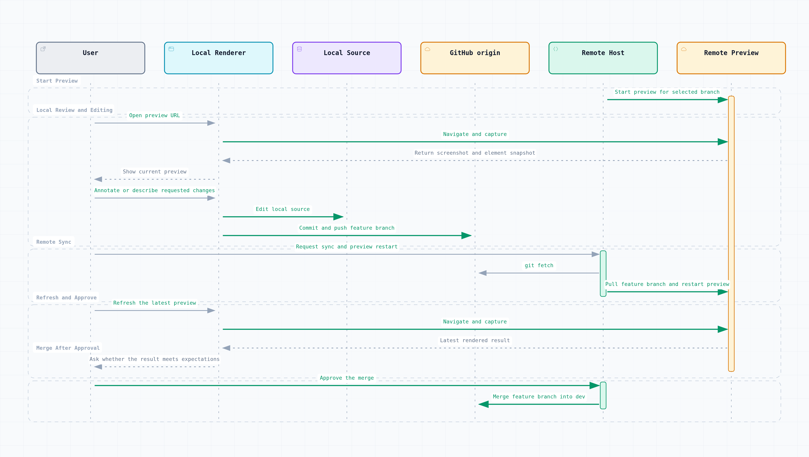

# Cross-Machine Collaborative Development Preview Workflow

English | [Chinese](dev-workflow-zh.md)

Status: active
Last updated: __replace with the current date when applying this workflow__
Applies to: the local development preview loop between a local rendering machine and a remote hosting machine. A coding session can begin on either side, while hosting remains fixed on the remote machine. **This workflow does not choose a production deployment target.** GitHub Pages, Cloudflare Pages, Vercel, self-hosting, and other options remain open in [Open Decisions](open-decisions.md). This workflow covers only the "change code → validate the local rendering → change it again" iteration loop.

## Background and goal

This workflow supports a personal development pattern in which visual review and annotation happen through Claude Desktop on one machine, where a larger display and desktop experience are preferable, while another machine always hosts the website process. Git needs to connect both sides into a repeatable "change → preview → feedback → change again" loop, with changes potentially originating on either side.

**Critical distinction: do not equate the environment that hosts the current coding session with the hosting machine.** A Claude Code CLI or Claude Desktop coding session may run on either the local rendering machine or the remote hosting machine, depending on where the user starts the conversation. That is independent of the machine where the website preview service is always hosted. The rest of this document separates the **hosting role**—always the remote machine at `__PREVIEW_HOST__`—from the **machine that starts the coding session**, which may be either side and can change at any time.

## Scope assessment

The scope is **appropriate** for the following reasons:

- It introduces no dependency or framework. It reuses the project's existing static-file server, such as `python3 -m http.server`, the existing GitHub remote, and the browser-control toolchain already available on the rendering machine.
- It adds no persistent service. Synchronization and restart operations are one-shot scripts invoked when needed, with low troubleshooting cost. Explicit invocation is preferred to automatic polling.
- It adds no annotation tool. Claude Desktop's own capabilities are used first. Only if validation proves them unavailable does the workflow fall back to Playwright MCP element targeting plus a textual description; it does not create a separate local annotation service or database.
- It adds only one worktree on the remote hosting machine, dedicated to preview. There are no nested worktrees or branch matrices whose management cost would exceed their value.

## Roles and environments

| Role | Location | Responsibility |
|---|---|---|
| Remote hosting machine | LAN address `__PREVIEW_HOST__`, user `__REMOTE_USER__`, and actual repository path `__REMOTE_REPO_PATH__`, with a sibling preview worktree | Host the preview static server and run `preview.sh`. It is **not** a fixed environment for coding sessions; only the website process is fixed to this machine. |
| Local rendering machine | The machine used for daily coding and rendering validation—Windows in the example, but it may run any operating system | Run Claude Desktop or Claude Code coding sessions, read and write the local Git clone directly, execute `sync.ps1` and `restart-remote.ps1`, and use a paired, controllable Chrome browser extension for rendering validation |
| GitHub origin | `https://github.com/__GITHUB_OWNER__/__GITHUB_REPO__.git` | Shared remote for bidirectional synchronization, with no additional relay |

The coding session itself can run on the local rendering machine or the remote hosting machine because both can run Claude Code. This does not change the workflow: regardless of where a change begins, it ultimately travels through Git to the remote hosting machine, where the preview restarts.

## Network and access

- First confirm that the local rendering machine and remote hosting machine are on the same LAN, or have a working private-network tunnel or VPN. The LAN address should be directly reachable without an additional SSH tunnel, and ICMP plus SSH on port 22 must be verified in advance.
- Port: if a common port on the remote hosting machine, such as `8000`, is already in use by another project, assign this workflow a dedicated fixed port represented by **`__PREVIEW_PORT__`**. The stable preview URL is `http://__PREVIEW_HOST__:__PREVIEW_PORT__/`.
- **Common network troubleshooting direction:** if the process launched by `preview.sh` listens on `0.0.0.0:__PREVIEW_PORT__`, but a TCP connection from the local rendering machine to `__PREVIEW_HOST__:__PREVIEW_PORT__` times out or is refused even though ICMP and SSH on port 22 work, the likely cause is a host firewall on the remote machine that allows only selected ports. Allow the preview port, at least for the LAN subnet, and verify it from the local rendering machine with a tool such as `Test-NetConnection`. Environment-specific debugging records belong in the project's own `progress.md` or `known-issues.md`, not in this design document.

## Rendering and annotation mechanism (verified recommended approach)

**Conclusion: Playwright MCP is not required. Claude Desktop's paired Chrome extension works and is the preferred path.**

- If `claude_desktop_config.json` on the local rendering machine already contains a paired Chrome browser extension through `chromeExtension.pairedDeviceName` with `allowAllBrowserActions: true`, use it directly. This is not Claude Desktop's Artifact sandbox preview, which can render only model-generated content hosted in its sandbox. It is a separate extension bridge that can control the user's actual browser.
- Call `list_connected_browsers` first to confirm that the connection is live and reports `isLocal: true`. Then use `navigate` to open `http://__PREVIEW_HOST__:__PREVIEW_PORT__/`. Rendering occurs in a real Chrome window visible on the user's desktop, not in a panel embedded in Desktop. If rendering strictly inside the Desktop window rather than in a separate desktop Chrome window is required, the user must decide whether this distinction is acceptable.
- Annotation: this mechanism does not provide a visual "select an element and attach a sticky-note comment" UI. Annotation is **conversational**: the user views the rendering and describes the desired change in text. When precise targeting is needed, Claude can read the page through an accessibility snapshot, `get_page_text`, or a screenshot to obtain an element reference, then use that reference in the discussion. It does not rely on a separate overlay or annotation database.

### Fallback: Playwright MCP

Use Playwright MCP only when a different local rendering machine has no paired Chrome extension and `list_connected_browsers` returns an empty result:

- Add the following to the Claude Desktop MCP configuration, `claude_desktop_config.json`, on the local rendering machine:

```json
{
  "mcpServers": {
    "playwright": {
      "command": "npx",
      "args": ["-y", "@playwright/mcp@latest"]
    }
  }
}
```

- Rendering falls back to opening the preview URL with `browser_navigate` and capturing a screenshot or a numbered accessibility tree with `browser_take_screenshot` or `browser_snapshot`.
- Annotation remains textual, with element `ref` numbers for precise targeting.

## Branch and worktree layout

Retain the global Git workflow: stable `main`, integration branch `dev`, and `feature/description` branches. Add one preview-only worktree on the remote hosting machine. The reason is that the remote machine may simultaneously have direct CLI changes on `dev` and an urgent preview of a `feature` branch; those activities must not share a working directory or interfere with each other.

```text
__PROJECT_NAME__/                  # Daily development directory on the remote hosting machine; follows dev
__PROJECT_NAME__.preview/          # New worktree dedicated to checking out an acceptance branch and running the static server
```

- Remote hosting machine main directory, at the actual path `__REMOTE_REPO_PATH__`: used for ordinary direct changes, committed normally to `dev` or a temporary `feature/*` branch.
- Remote hosting machine preview worktree, the sibling `__PROJECT_NAME__.preview`: runs only the static server. Do not edit code there. Check out whichever branch needs visual review without disturbing the main directory. It uses detached HEAD mode for the reason below.
- Local rendering machine: clone the same repository from `https://github.com/__GITHUB_OWNER__/__GITHUB_REPO__.git`, edit on a `feature/description` branch, do not edit `dev` or `main` directly, and push the feature branch when ready.

**Constraint when creating the worktree:** Git does not allow one branch to be checked out in two worktrees at the same time. For example, if the main directory already has `dev` checked out, `git checkout dev` in the preview worktree fails with `already used by worktree`. Create the preview worktree in **detached HEAD** mode with `git worktree add --detach ../__PROJECT_NAME__.preview dev`. Whenever a branch needs previewing, run `git checkout --detach <latest commit from branch or origin/branch>` instead of checking out the branch itself. The preview worktree then cannot conflict with the main directory regardless of its current branch, including when previewing `dev` or `main`.

**The worktree on the local rendering machine is a separate tool-managed concern and does not require manual management.** When a Claude Code or Claude Desktop coding session changes code on the local rendering machine, the toolchain creates an isolated worktree and branch for the session, for example `.claude/worktrees/<session-name>` on a branch such as `claude/<session-name>`. It does not disturb the main directory, which follows `main`. This already provides worktree isolation for changes, so this design does not add another manual worktree manager on the local rendering side. The session branch later follows the normal push → synchronize → optionally merge path back to `dev` or `main`.

## Source synchronization scripts (bidirectional, one command)

Both sides share the same GitHub remote, so bidirectional synchronization requires no relay service. A thin shell or PowerShell script can wrap `fetch + pull --rebase + push`:

- `scripts/dev/sync.sh`, portable across Linux, macOS, and Git Bash: run `git fetch` and `git pull --rebase` for the current branch, then `git push` when local commits have not been pushed.
- `scripts/dev/sync.ps1`, for Windows PowerShell or the corresponding local rendering shell environment: perform the same operation for Claude Desktop or direct user invocation on the local rendering machine. It also accepts an optional `-RestartPreview` switch, disabled by default so it remains equivalent to `sync.sh`. After a successful push, the switch calls `restart-remote.ps1` over SSH to restart the preview on the remote hosting machine, reducing "change → synchronize → restart → view" to one command.
- Both scripts are committed and distributed to both machines through Git, with no separate copies to maintain.
- **Configuration source:** environment-specific values used by either script—remote address, port, username, and repository path—are **never hard-coded as script defaults**. They all come from `scripts/dev/dev-workflow.env`, which is excluded by `.gitignore`. If the file or a required field is missing, the script must report a clear error and instruct the user to copy `scripts/dev/dev-workflow.env.example` to `scripts/dev/dev-workflow.env` and fill it in. It must not silently apply a potentially incorrect default. This prevents environment values from drifting across projects and environments and prevents real details from one environment from leaking into the scaffold.
- **Previously encountered pitfall:** a `.ps1` file containing Chinese comments must be saved as UTF-8 with a BOM. Windows PowerShell 5.1 otherwise decodes the source with the system ANSI code page, which can turn UTF-8 Chinese bytes into mojibake and produce apparently unrelated syntax errors around strings or parentheses. The distinguishing evidence is that the errors occur only when the `.ps1` file is executed directly even though file viewers display its content correctly. Rewrite it with a BOM-aware encoder such as `[System.Text.UTF8Encoding]::new($true)` and confirm the leading bytes are `EF BB BF`. First-party scripts now use English comments, but the encoding boundary still matters if downstream projects add non-ASCII text.

## Preview service script (invoked on demand, not persistent)

- `scripts/dev/preview.sh`, used only on the remote hosting machine, operates on the `../__PROJECT_NAME__.preview` worktree. It reads configuration such as repository path and port from `scripts/dev/dev-workflow.env` and reports an error rather than using defaults when configuration is missing. It supports four subcommands:
  - `preview.sh serve <branch>`: if the worktree does not exist, create it with `--detach`. After `git fetch`, run `git checkout --detach origin/<branch>` for the reason in the previous section. Start the static server in the background on `__PREVIEW_PORT__`. Find the PID by identifying the process listening on that port and write it to the PID file instead of trusting shell `$!`, which is unreliable in cases such as `setsid`.
  - `preview.sh restart [branch]`: use the exact order **successfully run `git fetch` and `git checkout --detach origin/<branch>`, then stop the old process, then start the new process**. When no branch is provided, fetch and check out the latest commit from the currently previewed branch. Do not reverse this order: if the old process stops before a network operation and `fetch` or `checkout` fails during a network interruption, the service remains down, which is worse than its pre-restart state. Use the PID file throughout, with a lookup by listening port as a fallback validation, to determine whether the process is alive and avoid duplicate starts or killing an unrelated process.
  - `preview.sh stop`: kill the process identified by the PID file or listening-port lookup and clean up.
  - `preview.sh status`: report whether a preview process is running, which port it listens on, and which commit it serves.
- Because each operation is invoked on demand rather than through an automatic polling watcher, the script does not need the complexity of `trap` or persistent lifecycle management. Every invocation is a simple, controlled foreground command.
- **Two trigger paths are supported:**
  1. Run it from a session on the remote hosting machine, as in the original design. A Claude Code session or the logged-in user can execute `preview.sh restart` directly.
  2. Trigger it over SSH from the local rendering machine, as described in Remote Restart below. No separate remote coding session is needed: `restart-remote.ps1` invokes the same `preview.sh restart` command on the hosting machine. The remote logic is identical; only the origin of the request differs.

## Remote restart (local rendering machine → remote hosting machine over SSH)

To run the entire "change source → synchronize → restart → view" loop from the local rendering machine without manually switching to a remote session, add:

- `scripts/dev/restart-remote.ps1`, used only on the local rendering machine: connect to the remote hosting machine over SSH, `cd` to the actual repository path, and run `./scripts/dev/preview.sh restart <branch>`. It does not reimplement remote logic; it only asks the remote machine to run it once. The default is the currently checked-out local branch and can be overridden with `-Branch`. All environment-specific values—host address, username, and repository path—come from `scripts/dev/dev-workflow.env`. Missing values produce an error and an instruction to complete the configuration file rather than hard-coded defaults.
- Dependency: passwordless SSH from the local rendering machine to `__PREVIEW_HOST__` as `__REMOTE_USER__`, using a **dedicated** key whose filename is given by `__SSH_KEY_NAME__`, for example `~/.ssh/id_ed25519_<project>_preview`, rather than reusing a GitHub or other-purpose key. When `REMOTE_USER` and `SSH_KEY_NAME` are set in `dev-workflow.env`, `restart-remote.ps1` connects directly to `user@host` with `-i ~/.ssh/<key> -o IdentitiesOnly=yes`. When neither is configured, it falls back to bare `ssh <host>`, resolved through a `Host __PREVIEW_HOST__` entry in `~/.ssh/config` with `IdentityFile` and `IdentitiesOnly yes`. In either path, the user must append the public key manually to `~/.ssh/authorized_keys` on the remote hosting machine. That step modifies access control on another machine, so Claude does not perform it; it only generates the keypair and instructions. **Important:** the presence of the remote host fingerprint in local `known_hosts` does not prove that passwordless login works. After configuration, execute an actual SSH command and verify that it succeeds without a password. Do not treat a configuration that merely looks correct as a working channel.
- `sync.ps1 -RestartPreview` calls this script automatically after a successful push, completing the loop in one command.

## End-to-end iteration

[](../diagrams/dev-workflow-loop.archify.html)

[Open the interactive sequence diagram](../diagrams/dev-workflow-loop.archify.html) · [View the Typed JSON diagram source](../diagrams/dev-workflow-loop.sequence.json)

**Shortcut:** in the diagram, the step "User → remote hosting machine: request synchronization and preview restart" does not require a separate remote session when the local rendering machine originated the change. Run `sync.ps1 -RestartPreview` locally. After pushing, it triggers `preview.sh restart` remotely over SSH. This combines the diagram's `Win → Hub`, `User → Linux`, `Linux → Hub`, and `Linux → Preview` steps and removes one manual context switch.

## Implementation checklist

For a new project cloned from this scaffold, build the preview loop from scratch as follows:

1. Run the scaffold's `init.mjs` to replace `__PROJECT_NAME__`, `__PROJECT_SLUG__`, `__GITHUB_OWNER__`, `__GITHUB_REPO__`, and the other placeholders with real project values.
2. Copy `scripts/dev/dev-workflow.env.example` to `scripts/dev/dev-workflow.env`, which remains untracked, and fill in the actual remote address, port, username, repository path, and related values.
3. On the remote hosting machine, create the detached preview worktree with `git worktree add --detach ../<project-name>.preview dev`.
4. Add or confirm the presence of `scripts/dev/sync.sh`, `scripts/dev/sync.ps1`, `scripts/dev/preview.sh`, and `scripts/dev/restart-remote.ps1`, with executable permissions on the `.sh` files.
5. Generate a dedicated SSH key named through `__SSH_KEY_NAME__`, configure the local `Host` entry in `~/.ssh/config`, and manually install the public key in `~/.ssh/authorized_keys` on the remote hosting machine. Execute an SSH command to prove passwordless access works; do not infer it from `known_hosts`.
6. On the local rendering machine, check Chrome extension pairing with `list_connected_browsers` and complete an actual validation following the Rendering and Annotation Mechanism section. If the extension is not paired, use the Playwright MCP fallback.
7. Run `sync.sh` and `sync.ps1` once on their respective machines and confirm that each can see the other's commits.
8. Complete one end-to-end "change → push → remote restart → local rendering confirmation" validation. Run `sync.ps1 -RestartPreview` on the local rendering machine, then confirm that the remote preview service has restarted and the latest content is accessible in the browser.
9. If networking fails—for example, ping and SSH work but the preview port is unreachable—follow Network and Access and record project-specific troubleshooting in that project's own `progress.md` or `known-issues.md`, not in this design document.

## Open items

- The production deployment target—GitHub Pages, Cloudflare Pages, Vercel, or self-hosting—remains undecided; see [Open Decisions](open-decisions.md). This workflow covers only local preview and can evolve independently of production deployment.
