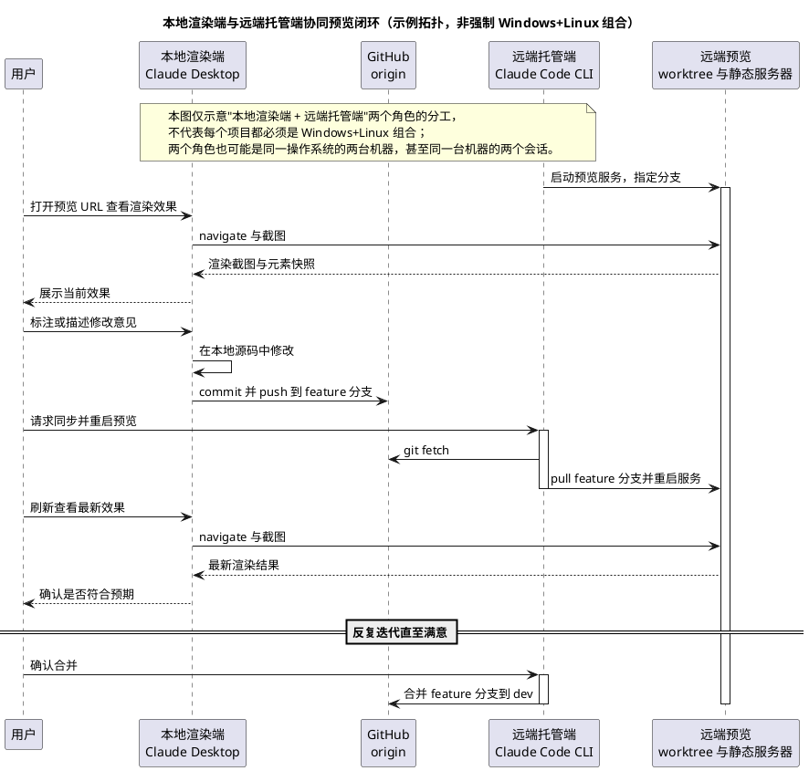
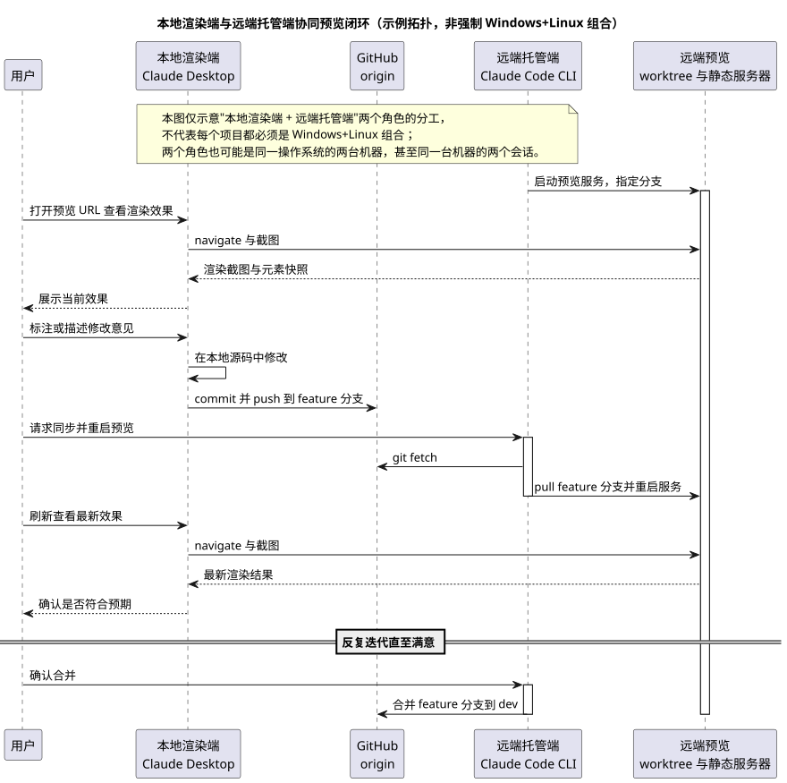

# 跨机协同开发预览工作流

状态：active
最近更新：__在实际使用时更新为当前日期__
适用范围：本地渲染端机器与远端托管机之间的本地开发预览闭环（编码会话可以在任意一端发起，托管固定在远端托管机一端）。**不决定生产部署目标**——GitHub Pages / Cloudflare Pages / Vercel / 自托管仍是 [待决策问题](open-decisions.md) 中的未决项，本工作流只覆盖"改代码 → 本地渲染验证 → 再改"的迭代环节。

## 背景与目标

个人开发习惯是：视觉审查和标注在一台机器上用 Claude Desktop 完成（大屏、桌面端体验更好），网站进程托管固定放在另一台机器上。需要把这两端用 git 串起来，形成一个可重复的"改动 → 预览 → 反馈 → 再改动"闭环，且改动可能来自任意一端。

**关键澄清：不要把"当前编码会话所在环境"等同于"托管机"。** Claude Code CLI / Claude Desktop 的编码会话可以运行在本地渲染端或远端托管机任意一端（取决于用户在哪台机器上发起对话），与"网站预览服务固定托管在哪台机器"是两回事，不能划等号。本文件后续把两者分开描述：**托管角色**（固定是 `__PREVIEW_HOST__` 这台远端机器）与**发起编码会话的机器**（可以是任意一端，随时可能变化）。

## 工程量判断

判定为**刚刚好**，理由：

- 不引入任何新依赖或框架：复用项目已有的静态文件服务器（例如 `python3 -m http.server`）、已存在的 GitHub 远程仓库、渲染端已经可用的浏览器控制工具链。
- 不新建常驻服务：同步与重启都是按需触发的一次性脚本，不需要 systemd/守护进程，出问题时排查成本低（优先选择"按需触发"而非自动轮询）。
- 不新建标注工具：优先复用 Claude Desktop 自身能力，只有在验证后确认不可行时才退回 Playwright MCP 的元素定位 + 文字描述，不为"标注"单独造一套本地服务或数据库。
- worktree 只在远端托管机新增一个，职责单一（专门给预览用），不做多层嵌套 worktree 或分支矩阵，避免管理成本超过收益。

## 角色与环境

| 角色 | 位置 | 职责 |
|---|---|---|
| 远端托管机 | 局域网地址 `__PREVIEW_HOST__`，用户 `__REMOTE_USER__`，仓库实际路径 `__REMOTE_REPO_PATH__`（含同级的预览专用 worktree） | 托管预览用的静态服务器、跑 `preview.sh`；**不是**"编码会话固定所在环境"，只是网站进程固定托管在这台机器上 |
| 本地渲染端机器 | 用于日常编码与渲染验证的机器（示例中为 Windows，实际可以是任意操作系统） | 跑 Claude Desktop / Claude Code 编码会话（直接读写本机 git 副本、执行 `sync.ps1`/`restart-remote.ps1`），配对了可控制的 Chrome 浏览器扩展用于渲染验证 |
| GitHub origin | `https://github.com/__GITHUB_OWNER__/__GITHUB_REPO__.git` | 两端共同的远程仓库，承担双向同步，无需额外中转 |

编码会话本身可能运行在本地渲染端也可能运行在远端托管机上（两边都能跑 Claude Code），这不影响本工作流——不管从哪一端发起改动，最终都通过 git 走到远端托管机上重启预览。

## 网络与访问

- 需要先确认本地渲染端与远端托管机在同一局域网（或已建立可用的内网穿透/VPN 通道），可直接用局域网地址访问，无需额外的 SSH 隧道；两者之间的 ICMP 与 SSH（22 端口）需要提前验证连通。
- 端口：如果远端托管机的常用端口（例如 `8000`）已被其他项目占用，本工作流的预览服务应固定使用一个专属端口，用占位符 **`__PREVIEW_PORT__`** 表示，与 [CLAUDE.md](../../CLAUDE.md) 里给临时手动预览用的端口是两回事，互不冲突。预览 URL 固定为 `http://__PREVIEW_HOST__:__PREVIEW_PORT__/`。
- **常见网络故障排查方向**：如果 `preview.sh` 启动的进程已监听 `0.0.0.0:__PREVIEW_PORT__`，但从本地渲染端对 `__PREVIEW_HOST__:__PREVIEW_PORT__` 发起 TCP 连接超时/被拒，而 ICMP 和 SSH（22 端口）都通，通常根因是远端托管机的主机防火墙只放行了部分端口。需要在远端托管机上放行该端口（至少对局域网网段放行），再用类似 `Test-NetConnection` 的工具从本地渲染端验证。这类环境相关的具体调试记录应写入项目自己的 `progress.md` / `known-issues.md`，不属于本设计文档内容。

## 渲染与标注机制（推荐方案已验证可行）

**结论：不需要 Playwright MCP，Claude Desktop 自带的 Chrome 扩展配对机制就能用，这是首选方案。**

- 本地渲染端机器的 `claude_desktop_config.json` 里如果已经有一个配对好的 Chrome 浏览器扩展（`chromeExtension.pairedDeviceName`，且 `allowAllBrowserActions: true`），可以直接使用。这不是 Claude Desktop 的"Artifact"沙箱预览（那个只能渲染模型自己生成、托管在沙箱内的内容），而是一个独立的、能真正控制用户本机浏览器的扩展桥接。
- 先调用桥接的 `list_connected_browsers` 确认连接是活的（`isLocal: true`），再用 `navigate` 把浏览器导航到 `http://__PREVIEW_HOST__:__PREVIEW_PORT__/`——渲染发生在一个真实的、用户桌面上可见的 Chrome 窗口里（不是 Desktop 自身面板内嵌；如果需要严格"Desktop 窗口内渲染"而非"桌面上的独立 Chrome 窗口"，这一点需要用户确认是否可接受）。
- 标注方式：这套机制不提供"点选元素 + 写贴纸评论"式的可视化标注 UI。实际标注是**对话式**的——用户看着渲染结果，用文字描述想要的修改；需要精确定位时，可以让 Claude 读取页面（accessibility 快照 / `get_page_text` / 截图）拿到元素引用后再描述，而不是指望一个独立的标注浮层或数据库。

### 备用方案：Playwright MCP

如果换一台本地渲染端机器时发现 Chrome 扩展没有配对（`list_connected_browsers` 返回空），才需要退回 Playwright MCP：

- 在本地渲染端 Claude Desktop 的 MCP 配置（`claude_desktop_config.json`）里加入：

```json
{
  "mcpServers": {
    "playwright": {
      "command": "npx",
      "args": ["-y", "@playwright/mcp@latest"]
    }
  }
}
```

- 渲染方式退化为：用 `browser_navigate` 打开预览 URL，用 `browser_take_screenshot` 或 `browser_snapshot` 获取截图或带 `ref` 编号的无障碍树。
- 标注方式与上面一致：文字描述 + 引用元素 `ref` 编号精确定位。

## 分支与 worktree 布局

沿用全局 git 工作流约定（`main` 稳定 / `dev` 开发主干 / `feature/描述` 特性分支），并在远端托管机新增一个专用于预览的 worktree，理由是：远端托管机端可能同时存在"CLI 自己在 `dev` 上直接改动"和"某个 `feature` 分支需要马上预览"两件事，两者不应该共用同一个工作目录互相打扰。

```
__PROJECT_NAME__/                  # 远端托管机上的日常开发目录，跟随 dev
__PROJECT_NAME__.preview/          # 新增 worktree，专门用于 checkout 待验收分支并跑静态服务器
```

- 远端托管机主目录（实际路径 `__REMOTE_REPO_PATH__`）：日常直接改动使用，正常提交到 `dev` 或临时 `feature/*` 分支。
- 远端托管机预览 worktree（同级 `__PROJECT_NAME__.preview`）：只跑静态服务器，不在这里直接改代码，谁的分支要看效果就切过去看，和主目录互不干扰，采用分离头指针模式（原因见下）。
- 本地渲染端：clone 同一个仓库（`https://github.com/__GITHUB_OWNER__/__GITHUB_REPO__.git`），日常在 `feature/描述` 分支下编辑，不直接改 `dev` / `main`，改完 push 该分支。

**创建方式的一处约束**：git 不允许同一个分支在两个 worktree 里同时被检出（比如主目录已经在 `dev`，预览 worktree 就不能再 `git checkout dev`，会报 `already used by worktree`）。所以预览 worktree 用 `git worktree add --detach ../__PROJECT_NAME__.preview dev` 建成**分离头指针（detached HEAD）**模式，之后每次要看哪个分支的效果，都是 `git checkout --detach <分支或 origin/分支的最新提交>`，而不是切到分支本身。这样无论主目录当前停在哪个分支，预览 worktree 都不会和它冲突，包括预览 `dev` 或 `main` 自己的场景。

**本地渲染端的 worktree 是另外一回事，工具链自带，不用手动管理**：如果本地渲染端用 Claude Code / Claude Desktop 的编码会话来改代码，工具链本身会给每个会话自动建一个独立 worktree + 分支（例如 `.claude/worktrees/<会话名>`，分支名形如 `claude/<会话名>`），和主目录（跟随 `main`）互不干扰。这天然满足"发生改动时用 worktree 隔离"的诉求，不需要在这份设计里再手动搭一套本地渲染端 worktree 管理机制；该会话分支后续照常走 push → 同步 → （按需）合并的路径回到 `dev`/`main`。

## 源码同步脚本（双向、一键）

两端共用同一个 GitHub 远程，"双向同步"不需要额外的中转服务，一个薄的 shell / PowerShell 脚本封装 `fetch + pull --rebase + push` 即可：

- `scripts/dev/sync.sh`（Linux / macOS / Git Bash 通用）：给当前分支执行 `git fetch`，`git pull --rebase`，若有本地未推送的提交则 `git push`。
- `scripts/dev/sync.ps1`（Windows PowerShell，或对应本地渲染端 shell 环境）：同样的逻辑，供本地渲染端 Claude Desktop 或用户直接运行。额外支持一个可选开关 `-RestartPreview`（默认不开，不影响与 `sync.sh` 的对等行为）：推送成功后顺带调用 `restart-remote.ps1` 通过 SSH 让远端托管机预览重启，把"改代码→同步→重启→查看"收成一条命令。
- 两个脚本都提交进仓库，随 git 同步分发到两端，不需要分别维护。
- **配置来源**：两个脚本涉及的远端主机地址、端口、用户名、仓库路径等环境相关的值，**不写死在脚本默认值里**，一律从 `scripts/dev/dev-workflow.env`（不进版本库，被 `.gitignore` 忽略）读取。缺失该文件或缺失必需字段时，脚本必须报清晰错误并提示"复制 `scripts/dev/dev-workflow.env.example` 为 `scripts/dev/dev-workflow.env` 并填写"，而不是静默套用一个可能错误的默认值。这是为了避免环境值在脚本里硬编码导致跨项目/跨环境漂移，也避免把某个具体环境的真实信息带入脚手架模板。
- **踩过的坑**：`.ps1` 文件里带中文注释时必须存成**带 BOM 的 UTF-8**。Windows PowerShell 5.1 解析 `.ps1` 源码时，没有 BOM 就按系统 ANSI 代码页解码，可能把 UTF-8 的中文字节序列读成乱码，进而在字符串/括号处报一堆看似无关的语法错误。判断依据：这类报错只在直接执行 `.ps1` 文件时出现，用文件查看工具读出来的内容看着完全正常。修法是用 `[System.Text.UTF8Encoding]::new($true)` 之类方式重新写盘，确保开头是 `EF BB BF`。

## 预览服务脚本（按需触发，不常驻）

- `scripts/dev/preview.sh`（只在远端托管机用）：操作对象是 `../__PROJECT_NAME__.preview` 这个 worktree，配置（仓库路径、端口等）同样从 `scripts/dev/dev-workflow.env` 读取，缺失时报错而不是套用默认值。支持四个子命令：
  - `preview.sh serve <分支>`：如果 worktree 不存在则用 `--detach` 创建，`git fetch` 后 `git checkout --detach origin/<分支>`（分离头指针，原因见上一节），在后台启动静态文件服务器（监听 `__PREVIEW_PORT__`），PID 通过反查监听该端口的进程获得并写入 PID 文件，而不是信任 shell 的 `$!`（在 `setsid` 等场景下 `$!` 不可靠）。
  - `preview.sh restart [分支]`：正确顺序是**先 `git fetch` + `git checkout --detach origin/<分支>` 成功，再停旧进程，再启动新进程**（不传分支则重新拉取并检出当前预览的那个分支的最新提交）。顺序不能反——如果先停旧进程再做网络操作，一旦 `fetch`/`checkout` 因网络抖动失败，会导致预览服务"只停不起"，比重启前更糟。全程按 PID 文件（且用监听端口反查进程作为兜底校验）判断进程是否存活，避免重复启动或杀错进程。
  - `preview.sh stop`：按 PID 文件（或反查监听端口）杀进程并清理。
  - `preview.sh status`：查询当前是否有预览进程在跑、监听哪个端口、对应哪个 commit，便于排查。
- 因为是按需触发（不需要自动轮询 watcher），这个脚本不需要 `trap`/常驻生命周期管理这类复杂度，每次都是一次性前台命令，简单可控。
- **触发方式有两种**：
  1. 人工经由远端托管机端会话执行（原始设计）：不管是 Claude Code 会话还是用户自己登录，只要在远端托管机上直接跑 `preview.sh restart` 即可。
  2. 本地渲染端直接 SSH 触发（见下一节"远程重启"）：不需要额外开一个远端托管机端会话，`restart-remote.ps1` 会通过 SSH 在远端托管机上执行同一个 `preview.sh restart`，两种方式最终跑的是同一段远端逻辑，只是发起点不同。

## 远程重启（本地渲染端 → 远端托管机，通过 SSH）

为了让"改源码→同步→重启→查看"能在本地渲染端一端一次性发起、不必再手动切到远端托管机端会话，新增：

- `scripts/dev/restart-remote.ps1`（只在本地渲染端用）：SSH 到远端托管机，`cd` 到仓库实际路径后执行 `./scripts/dev/preview.sh restart <分支>`。不重新实现远端逻辑，只是把"喊它跑一次"这一步从本地渲染端补上。默认分支取本地当前分支，也可用 `-Branch` 显式指定。所有环境相关的值（主机地址、用户名、仓库路径）同样从 `scripts/dev/dev-workflow.env` 读取，缺失时报错并提示补全配置文件，不在脚本里写死默认值。
- 依赖：本地渲染端到 `__PREVIEW_HOST__`（用户 `__REMOTE_USER__`）的免密 SSH 登录，用一把**专用**密钥（占位符 `__SSH_KEY_NAME__`，例如 `~/.ssh/id_ed25519_<项目>_preview` 这种命名模式，不复用 GitHub 或其它用途的密钥）。`restart-remote.ps1` 会在 `dev-workflow.env` 里配置了 `REMOTE_USER` / `SSH_KEY_NAME` 时，直接以 `user@host` 并 `-i ~/.ssh/<密钥> -o IdentitiesOnly=yes` 发起 SSH；两者都没配置时退回裸 `ssh <host>`，改由 `~/.ssh/config` 的 `Host __PREVIEW_HOST__` + `IdentityFile` + `IdentitiesOnly yes` 解析。无论走哪条路，公钥都需要用户手动追加到远端托管机 `~/.ssh/authorized_keys`（这一步涉及修改远端机器的访问控制，Claude 不代为操作，只生成密钥对和使用说明）。**注意**：仅仅在本地 `known_hosts` 里出现远端主机指纹，不代表免密登录已经生效，配好后必须实际执行一次 SSH 命令验证能无密码登录成功，不能只凭配置文件"看起来对"就认为通道已打通。
- `sync.ps1 -RestartPreview` 会在推送成功后自动调用这个脚本，实现单条命令收尾。

## 端到端迭代流程





**捷径**：图中"User → 远端托管端：请求同步并重启预览"这一步，如果本地渲染端就是发起改动的一方，不必真的去找一个远端托管端会话——直接在本地渲染端跑 `sync.ps1 -RestartPreview` 即可，它会在推送成功后自己通过 SSH 触发远端托管端的 `preview.sh restart`，等价于图中 `Win → Hub`、`User → Linux`、`Linux → Hub`、`Linux → Preview` 这几步揉在一起，少一次人工切换。

## 落地步骤 Checklist

面向刚 clone 这个脚手架的新项目，从零搭建这套预览闭环：

1. 运行脚手架的 `init.mjs`，把 `__PROJECT_NAME__`、`__PROJECT_SLUG__`、`__GITHUB_OWNER__`、`__GITHUB_REPO__` 等占位符替换成本项目的真实值。
2. 复制 `scripts/dev/dev-workflow.env.example` 为 `scripts/dev/dev-workflow.env`（不进版本库），填写远端托管机地址、端口、用户名、仓库路径等实际值。
3. 在远端托管机上创建预览 worktree（分离头指针模式）：`git worktree add --detach ../<项目名>.preview dev`。
4. 新增/确认 `scripts/dev/sync.sh`、`scripts/dev/sync.ps1`、`scripts/dev/preview.sh`、`scripts/dev/restart-remote.ps1` 四个脚本存在且（`.sh` 部分）带可执行权限。
5. 生成一把专用 SSH 密钥（`__SSH_KEY_NAME__`），配置本地 `~/.ssh/config` 的 `Host` 条目，并把公钥手动装到远端托管机的 `~/.ssh/authorized_keys`；实际执行一次 SSH 命令验证免密登录生效（不要只看 `known_hosts` 就假设通了）。
6. 在本地渲染端确认 Chrome 扩展配对状态（`list_connected_browsers`），按"渲染与标注机制"一节完成一次现场验证；如果扩展未配对，退回 Playwright MCP 备用方案。
7. 两端各跑一次 `sync.sh` / `sync.ps1`，确认能互相看到对方的提交。
8. 走一轮完整"改动 → 推送 → 远程重启 → 本地渲染端渲染确认"的端到端验证：本地渲染端跑 `sync.ps1 -RestartPreview`，确认远端预览服务重启并可通过浏览器访问到最新内容。
9. 如遇网络不通（能 ping 通/能 SSH 但预览端口不可达等），按"网络与访问"一节的排查方向处理，并把本项目具体的排查记录写入项目自己的 `progress.md` / `known-issues.md`，不要写回本设计文档。

## 未决事项

- 生产环境最终部署目标（GitHub Pages / Cloudflare Pages / Vercel / 自托管）仍未决定，见 [待决策问题](open-decisions.md)；本工作流只覆盖本地预览环节，与生产部署方式无关，二者可以独立演进。
