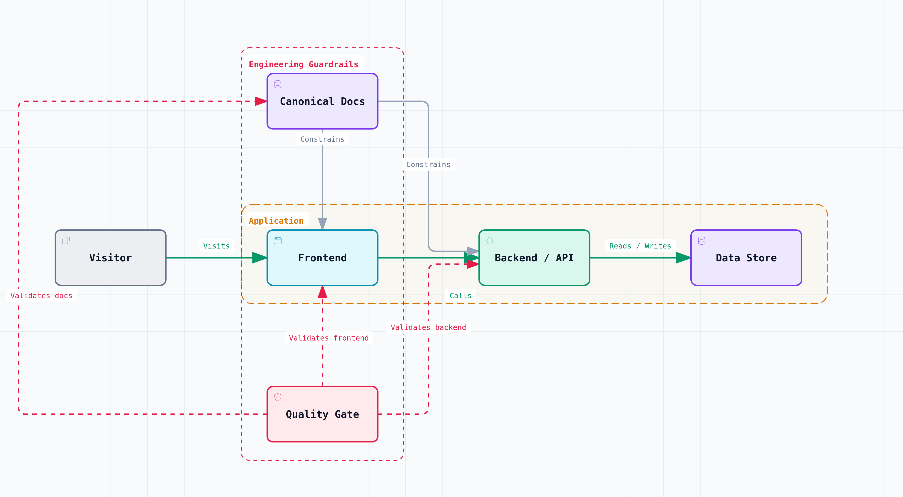

# Architecture Overview

English | [Chinese](overview-zh.md)

Status: __enter the current status here, for example, active__
Last updated: __enter the most recent update date here, for example, 2026-07-03__
Applies to: __describe the scope of this document here, for example, "the M0 full-stack project scaffold and engineering conventions"__

## Goal

The first release of __PROJECT_NAME__ aims to establish a maintainable __PROJECT_TAGLINE__ while leaving structural room for future capabilities.

## Current implementation

The following is a placeholder example. Replace it with the actual architecture of your project:

[Open the interactive diagram](../diagrams/architecture-overview.archify.html) · [View the Typed JSON diagram source](../diagrams/architecture-overview.architecture.json)

Based on the actual project, explain whether it currently includes a runtime backend, database, authentication, comment system, user-data collection, or similar capabilities, and state the stage of each capability.

## Directory responsibilities

The following are common directory examples for a full-stack project. They are provided only as a reference; adapt this section to your actual directory structure:

- `frontend/` or `apps/web/`: frontend application entry points and assets.
- `backend/` or `apps/api/`: backend services and API implementation.
- `docs/`: the source of truth for positioning, architecture, the content model, product and service evolution, and contract terms.
- `codex-rules/`: operating rules for Agents performing tasks.
- `.claude/skills/archify/`: the pinned diagram-authoring, validation, and interactive HTML rendering capability.
- `scripts/quality/`: CI and local quality gates.
- `.github/`: PR templates, CODEOWNERS, and CI.

## Evolution principles

- Before adopting a framework, identify the problem it solves, such as content scale, routing, builds, SEO, MDX, search, or deployment.
- Before introducing user interaction, define privacy boundaries, abuse risks, data-retention policy, and deletion policy.
- Before launching a product service, define the service boundary; do not substitute marketing copy for an accurate capability description.
- Divide modules for high cohesion and low coupling: group closely related responsibilities within a module, and let modules interact only through explicit contracts such as interface signatures, events, or DTOs. Modules must not share internal implementation details or bypass layers to read or write another module's data structures directly. To judge whether a split is sound, ask whether changing one module's internal implementation also requires changing another module. If it does, the coupling is too high.
- Organize docs by the same principle: keep one source-of-truth spec for each module or decision. Higher-level architecture documents such as this one contain only pointers and summaries rather than duplicated details. When implementing a new decision, update its dedicated spec first and then refresh the higher-level summary so the same design does not become scattered and inconsistent.
