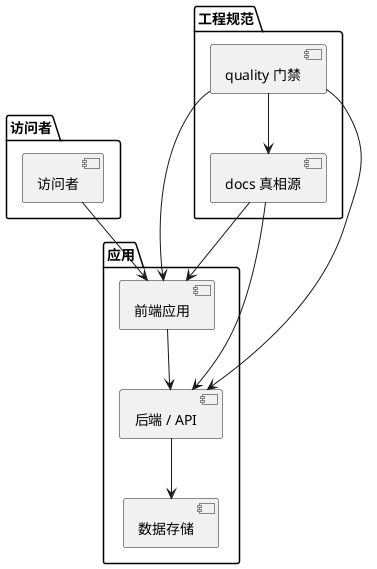
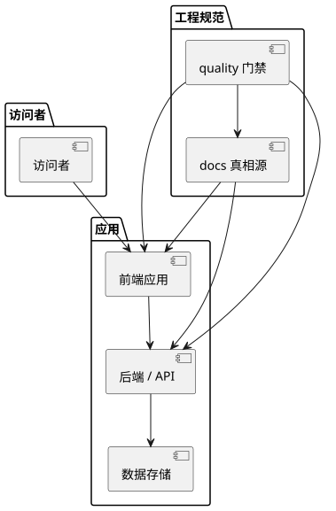

# 架构概览

状态：__在这里写当前状态，例如 active__
最近更新：__在这里写最近一次更新日期，例如 2026-07-03__
适用范围：__在这里写这份文档的适用范围，例如"M0 全栈项目脚手架与工程规范"__

## 目标

__PROJECT_NAME__ 的首版目标是建立一个可维护的 __PROJECT_TAGLINE__，并提前保留向后续能力演进的结构空间。

## 当前实现

以下是占位示例，请替换成你项目的实际架构：

请根据实际情况补充说明当前是否有运行时后端、数据库、登录、评论系统或用户数据采集等能力，以及各能力所处的阶段。

## 目录职责

以下为全栈项目常见目录示例，仅供参考，请根据你的实际目录结构调整这一节：

- `frontend/` 或 `apps/web/`：前端应用入口和资源。
- `backend/` 或 `apps/api/`：后端服务与 API 实现。
- `docs/`：定位、架构、内容模型、产品服务演进和契约词表的真相源。
- `codex-rules/`：Agent 执行任务时的操作规范。
- `scripts/quality/`：CI 和本地质量门禁。
- `.github/`：PR 模板、CODEOWNERS 和 CI。

## 演进原则

- 引入框架前先明确框架解决的问题，例如内容规模、路由、构建、SEO、MDX、搜索或部署需求。
- 引入用户交互前先明确隐私边界、滥用风险、数据保留和删除策略。
- 产品服务上线前先明确服务边界，不用营销文案替代真实能力说明。
- 模块划分遵循高内聚低耦合：模块内部把高度相关的职责聚合在一起；模块之间只通过明确的契约（接口签名、事件、DTO）交互，不共享内部实现细节，也不越层直接读写对方的数据结构。判断一次拆分是否合理，看改一个模块的内部实现是否需要连带改动另一个模块——需要就说明耦合过高。
- docs 组织同理：每个模块或每个决议只保留一份真相源 spec，上层架构文档（如本文件）只放"指针 + 摘要"，不重复正文；新决议落地时先改对应 spec，再回写上层摘要，避免同一份设计在多处分散、口径不一致。
