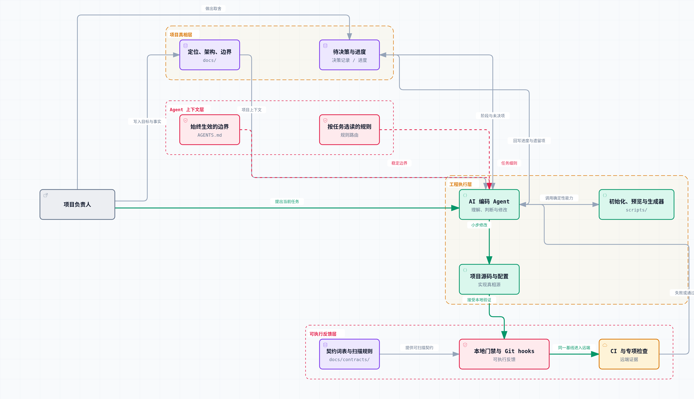
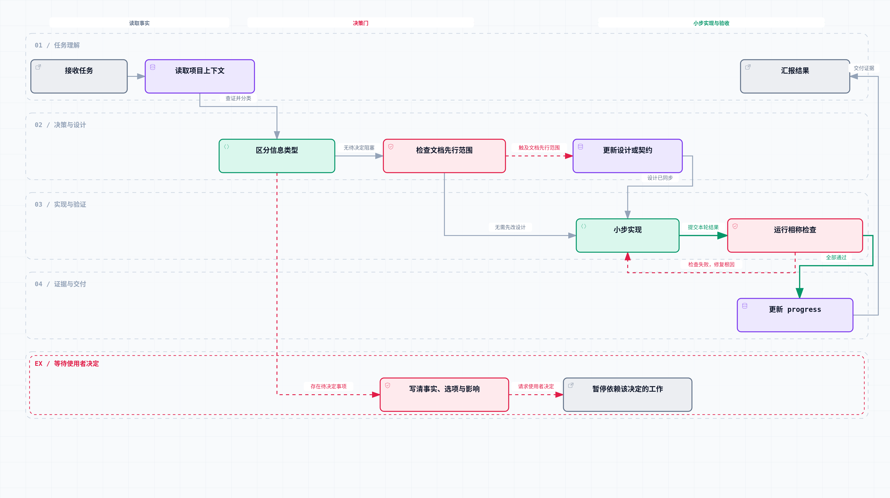
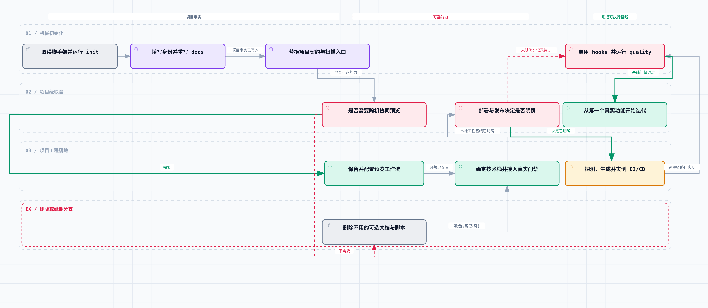
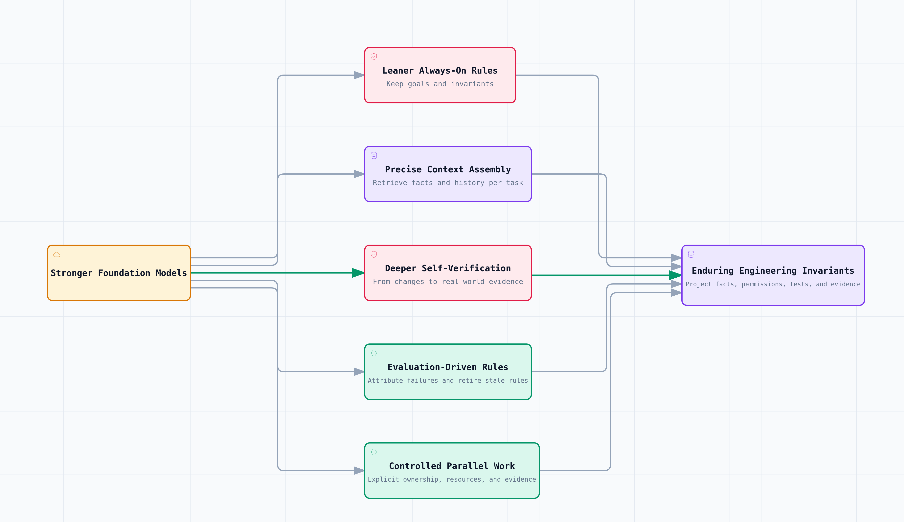

# AI 编码脚手架：从一次对话到可复用的工程闭环

[English](ai-coding-scaffold.md) | 中文

状态：可公开发布

最近更新：2026-08-30

适用范围：技术栈中立的 AI 编码脚手架设计、复用与演进

> 摘要：AI 编码的难点正在从“能不能生成代码”转向“能不能理解项目、遵守边界并完成验证”。本文介绍一套技术栈中立的工程脚手架：用文档保存项目事实，用分层规则装配 Agent 上下文，用确定性脚本执行机械工作，再用本地门禁和 CI 形成反馈闭环。

## 从“生成代码”到“维护项目”

刚开始使用 AI 编码时，我关注的是需求能否描述清楚、生成的函数能否运行。随着项目逐渐变长，真正反复消耗时间的却变成了另外几件事：

- 模型不知道这个项目为什么这样设计；
- 同一个约定散落在聊天、文档和代码里，过一段时间就互相矛盾；
- 模型完成了一次修改，却没有证明文档、实现、测试和 CI 仍然一致；
- 新项目启动时，我又要从头解释目录、命名、提交格式、安全边界和交付标准。

这让我把目标从“提高单次代码生成质量”调整为：**让每一次编码都进入可追溯、可验证、可复用的工程闭环。**

这套脚手架更像 AI 与项目之间的一层“工程控制面”。它不预设 React、Vue、Python 或 C++，也不代替项目负责人做产品决策；它负责组织项目事实、协作边界、执行入口和验证证据。

截至 2026-08-30，仓库仍是一份未初始化的通用模板。已实现的部分包括初始化脚本、文档与契约门禁、Agent 规则路由、Git hooks、通用 CI、可选的跨机预览、Archify 交互图表，以及 CI/CD 探测、台账驱动生成和本地门禁。它没有预装业务框架，`npm test` 仍是占位命令，CI/CD 与 Release 流程也还缺一次具体绿地项目的远端验收。实现边界可以从[使用说明](../../SCAFFOLD-zh.md)、[质量门禁](../architecture/quality-gates-zh.md)、[图表系统](../architecture/diagram-system-zh.md)和[CI/CD 自动搭建设计](../architecture/cicd-autosetup-zh.md)继续追溯。

## 把“提示词”沉淀为仓库资产

一段足够详细的 prompt 可以帮助模型完成短任务，但它很难独自承担长期项目的上下文管理：

- prompt 容易落后于项目当前状态；
- 自然语言可以描述“应该怎么做”，却无法证明结果已经做到；
- 对话中的信息不一定能被下一次会话或下一位协作者复用。

我的处理方式，是把原本散落在对话里的内容拆成四层仓库资产。

[](../diagrams/ai-scaffold-layers.archify.html)

[打开交互架构图](../diagrams/ai-scaffold-layers.archify.html) · [查看 Typed JSON 图表源](../diagrams/ai-scaffold-layers.architecture.json)

四层之间不是简单的文档分类，而是一条从项目事实到验证证据的依赖链。

### 1. 项目真相层：让模型先知道“什么是真的”

`docs/` 不再是实现完成后补写的说明书，而是项目定位、架构、产品边界和部署决策的真相源。内容被明确分成四类：

- **事实**：仓库、脚本或外部权威来源已经能证明的内容；
- **决定**：项目负责人明确选定的方向；
- **计划**：想做但还没有交付的能力；
- **尚未拍板**：只有项目负责人能取舍、Agent 不应该代猜的事项。

这种区分可以避免模型把“计划接入评论系统”改写成“已经支持评论”，也能防止一个临时技术偏好被自动升级为项目决策。

### 2. Agent 上下文层：让规则进入上下文，但不把上下文塞满

根目录的 `AGENTS.md` 只放所有任务都要遵守的项目边界，比如先读真相源、保护已有改动、文档先行和完成后验证。

更细的规则通过索引按任务加载：写 Markdown 时读取文档规则，修改 CI/CD 时读取对应规则，触及隐私时再加载安全与隐私约束。这里追求的不是规则数量，而是**稳定规则常驻、场景规则按需进入上下文**。

### 3. 工程执行层：把适合机器做的事情交给确定性脚本

模型擅长理解目标、分析取舍和生成方案，但批量替换占位符、扫描文件、渲染配置、检查路径这类事情，脚本通常更稳定。

因此，初始化器、质量脚本、预览脚本以及 CI/CD 探测与渲染器都被纳入脚手架。Agent 判断何时调用，脚本返回确定性结果，两者各自承担更擅长的部分。

### 4. 可执行反馈层：把“应该”变成“没有做到就失败”

仅仅在文档里写“不要泄漏密钥”“内部链接不要断”“改图后要能编译”，约束力其实有限。

脚手架会把高价值、能够稳定判断的约束进一步转成检查：

- Markdown 链接和文档索引检查；
- 品牌名、状态枚举和禁用旧名的契约扫描；
- 常见密钥形态扫描；
- 静态站点入口与相对资源检查；
- Archify Typed JSON 的 `showcase` 校验、交互 HTML 新鲜度与真实浏览器视觉复核；
- workflow 安全红线与 actionlint 语义检查；
- pre-commit 与远端 CI 复用同一条质量基线。

于是，Agent 返回的不再只是一句“已经改好”，而是可以继续定位的失败信息，或者可以随结果一同交付的通过证据。

## 把一次任务收进可验证闭环

仓库分层解决的是信息放在哪里，任务闭环解决的是这些信息如何参与一次真实修改。

[](../diagrams/ai-scaffold-task-loop.archify.html)

[打开交互工作流](../diagrams/ai-scaffold-task-loop.archify.html) · [查看 Typed JSON 图表源](../diagrams/ai-scaffold-task-loop.workflow.json)

这个流程的关键并不只是“先写文档”，而是实现之前的决策门。

比如，仓库里能查到当前没有数据库，这是事实；项目是否需要数据库，是决定；以后可能增加账号体系，是计划。模型可以查事实、分析选项，但不应该替项目负责人把后两件事混成已经确定的实现。

验证失败后，流程不会用“能跑就行”的兜底掩盖问题，而是保留真实错误并继续定位根因。对 AI 编码而言，高质量错误信息本身就是重要上下文，它能让下一轮修改从猜测转向定位。

## 仓库里的基础架构

这套脚手架的目录不是按某个业务框架划分，而是按“事实、规则、自动化、证据”划分。

```text
project/
├── AGENTS.md                 # 所有 Agent 始终遵守的项目边界
├── CLAUDE.md                 # Claude Code 对共享规则的导入入口
├── docs/
│   ├── README.md             # 文档索引
│   ├── architecture/         # 架构、质量门禁、工作流与待决策
│   ├── contracts/            # 机器可读的稳定词表和扫描规则
│   ├── product/              # 内容与产品边界
│   └── progress.md           # 完成证据与遗留项
├── codex-rules/              # Codex 按任务选读的规则
├── .claude/                  # Claude Code 的规则、hooks 与技能
├── scripts/
│   ├── init.mjs              # 初始化与占位符替换
│   ├── quality/              # 零依赖基础质量门禁
│   ├── dev/                  # 可选的同步与跨机预览
│   └── cicd/                 # CI/CD 探测与台账驱动渲染
├── .githooks/                # 提交前和提交信息门禁
├── .github/workflows/        # 远端 CI
└── package.json              # 命令的实现真相源
```

这套目录结构背后有三个主要取舍。

### 1. 文档不是越多越好，而是每类事实只保留一份

架构概览只放总体结构和链接，具体 CI/CD 行为回到 CI/CD 设计，命令的当前行为回到 `package.json` 和 workflow。上层文档不复制下层正文，避免两份说明一起过期。

### 2. JSON 是决策真相源，生成文件只是产物

契约词表、站点检查和项目级 CI/CD 决策都适合放在机器可读的 JSON 里。以 CI/CD 为例，项目相关的命令、部署目标和 secret 名来自决策台账，YAML 由渲染器单向生成。

这样既不会在脚手架里维护一堆“语言 × 部署平台”的成品模板，也不会让模型每次临场手写整份 workflow。不会随技术栈变化的安全骨架固化在渲染器里，会变化的命令和目标留给具体项目确认。

### 3. 本地和远端尽量说同一种语言

本地 pre-commit 调用 `npm run quality`，远端 CI 也调用同一条命令。Archify 图表交付检查和 actionlint workflow 语义检查等专项门禁放在独立 CI job 里；图表的深浅主题视觉复核另外使用真实浏览器完成。

这能减少一种很常见的摩擦：本地说“已经通过”，远端却执行了另一套隐含规则。

## 把脚手架迁移到一个新项目

复用这套脚手架，不是复制目录后立刻开始写业务代码。更重要的工作，是先把模板中的身份和示例事实迁移成新项目自己的内容，再决定哪些可选能力值得保留。

[](../diagrams/ai-scaffold-reuse-flow.archify.html)

[打开交互工作流](../diagrams/ai-scaffold-reuse-flow.archify.html) · [查看 Typed JSON 图表源](../diagrams/ai-scaffold-reuse-flow.workflow.json)

整个迁移过程可以分成四个阶段。

### 1. 完成机械初始化

```bash
npm run init
git config core.hooksPath .githooks
npm run quality
```

初始化器会收集项目标识、展示名、一句话定位、GitHub 信息和版权归属，也会询问是否保留跨机预览、是否现在处理 CI/CD。随后，它会替换双下划线包裹的大写占位符，并执行一次基础质量检查。

这一步只完成结构化占位符替换，不会自动完成产品定位和技术决策。“当前阶段做什么”“首版明确不做什么”“为什么选择某个框架”等内容，仍需回到真实项目逐项确认。

### 2. 让 `docs/` 描述真实项目

新项目至少需要补齐以下内容：

- 项目目标、目标用户、当前阶段、范围和非目标；
- 当前架构与目录职责；
- 第一批功能或内容的信息架构；
- 技术栈、部署、认证、数据与隐私待决策项；
- 已经确定的术语、状态枚举和跨模块契约。

完成这一步之后，Agent 读取到的才是项目上下文，而不是模板示例。

### 3. 让机器检查对齐真实约束

基础门禁可以继续使用，但示例配置不适合原样保留：

- 修改 `contract-terms.json` 里的品牌、枚举和稳定名；
- 修改 `contract-rules.json` 的扫描目录、禁用旧名和作用域规则；
- 修改 `site-checks.json` 的真实入口与必需片段；
- 选定技术栈后补 formatter、lint、typecheck、测试和构建；
- 引入数据库迁移后，再考虑迁移顺序一致性检查；
- 引入第三方依赖后，再确定锁文件和可复现安装策略。

### 4. 裁剪没有真实使用场景的模块

跨机预览、数据库迁移检查、某种语言的严格配置、Release 自动化，都不是每个项目的默认答案。

如果项目只在一台机器上开发，跨机预览文档和脚本就可以移除；当前没有数据库，也没有必要保留迁移门禁；部署目标尚未确定时，先记录未决事项即可，不必提前生成一套没有验收对象的 CD。

## 哪些部分不能照抄

从复用角度看，脚手架内容可以分成机制、事实和选配三类。真正容易产生问题的，不是漏改一个名字，而是把模板事实误当成通用机制。

| 类型 | 可以怎么处理 | 典型内容 |
| --- | --- | --- |
| 通用机制 | 先保留，再根据实际摩擦精炼 | 真相源分层、规则路由、决策门、进度记录、失败不静默放行、本地与 CI 共用基线 |
| 项目事实 | 需要替换，不适合照抄模板 | 项目定位、架构、阶段、目录、品牌词、状态枚举、扫描路径、用户数据、部署目标 |
| 按需能力 | 先判断是否有真实消费者 | 跨机预览、Python/TypeScript 配方、数据库迁移门禁、CI/CD、Release Please |

下面这份清单可以用来完成新项目的第一次适配。

### 项目与产品

- 项目名、品牌名、一句话定位；
- 目标用户、首版范围、明确非目标；
- 公开页面、内容栏目、路由与 SEO；
- 哪些能力是已交付，哪些只是计划；
- 是否有评论、表单、订阅、账号或其他用户数据。

### 架构与代码

- 实际技术栈和选择理由；
- 源码目录、模块边界和契约；
- 格式化、lint、类型、单元测试、集成测试与构建命令；
- 数据库、缓存、认证和迁移策略；
- 依赖与锁文件策略。

### 协作规则

- 文档先行覆盖哪些变化；
- 分支、提交信息和 PR 规则是否适合团队；
- UI 与注释使用什么语言；
- 哪些目录或生成文件不能手改；
- Agent 可以自动完成到哪里，哪些步骤必须由人授权。

### 运行与交付

- 本地预览是一台机器还是跨机协作；
- CI 要覆盖哪些操作系统和运行时；
- 部署目标、环境、凭证模式与回滚能力；
- 版本号真相源、tag 规则和 Release 节奏；
- 哪些平台配置只能人工完成。

“回滚能力”尤其需要按真实平台描述。站点和容器通常可以重新部署旧版本，但 npm、PyPI 等已经发布的包无法让历史消失，只能发布修复版本并弃用或撤回旧版本。把这些差异留在设计里，比统一写成“支持一键回滚”更有维护价值。

## 基础模型变强以后，脚手架应该怎样演进

基础模型能力持续提高，并不意味着 `AGENTS.md` 应该继续变长。恰恰相反，更强的推理、上下文和工具调用能力，为规则瘦身创造了空间。

脚手架可以逐渐从“详细描述每一步怎么做”，转向“提供真实目标、不可破坏的边界和可验证证据”。

[](../diagrams/ai-scaffold-evolution.archify.html)

[打开交互架构图](../diagrams/ai-scaffold-evolution.archify.html) · [查看 Typed JSON 图表源](../diagrams/ai-scaffold-evolution.architecture.json)

这条演进路径可以拆成五个方向。

### 1. 从“堆规则”转向“瘦规则”

随着模型理解能力提升，许多教学式步骤可以逐步删除，只保留项目目标、安全边界、关键不变量和交付判据。

规则是否值得常驻，可以看它是不是跨任务都成立；只在少数任务出现的细则，通过索引、技能或工具按需加载。这样既降低上下文噪声，也减少规则之间互相冲突。

### 2. 从“整份文档喂进去”转向“按任务装配上下文”

Agent 可以根据文件、模块和任务类型自动定位相关设计、历史决策、已知问题和测试，不再为每个任务读取整个文档库。

这里比向量检索本身更重要的，是每份资料有明确的所有者、状态和适用范围。检索再强，如果仓库里有三份互相矛盾的架构说明，模型只会更快地找到矛盾。

### 3. 从“本地代码通过”走向“真实环境证据”

更可靠的工具调用可以把闭环延伸到真实环境：生成配置、创建临时分支、观察 CI、读取失败日志，并在修复后重新验证。

但“全自动”仍然受权限和外部平台限制。需要浏览器授权、创建长期凭证或改变生产状态时，脚手架应该明确暂停点，而不是把权限问题伪装成技术问题。

### 4. 用评测治理规则，而不是凭感觉增加规则

每次失败都可以先按原因分类：

- 项目事实缺失；
- 规则表达不清；
- 约束只有文字、没有可执行检查；
- 检查本身误报或跨环境不稳定；
- 模型推理或工具调用失败。

不同原因对应不同的改进位置。链接频繁漏更新，可以增加机器检查；某条规则经常冲突，可以拆分或删除；图表则应把稳定判据和环境相关判据分开：Typed JSON 与交互 HTML 可以做 `showcase` 校验和确定性新鲜度检查，浏览器 PNG 受系统字体与渲染环境影响，只保留真实视觉复核证据，不做跨机器字节比较。

### 5. 并行 Agent 会更有用，但所有权要更明确

随着模型能力和工具编排继续提升，文档核对、实现、测试和审查可以交给不同 Agent 并行完成。

真正需要补的不是一句“请多 Agent 协作”，而是任务边界、文件所有权、共享资源、结果合并和验收证据。否则并行只会把单线程冲突变成多线程冲突。

无论模型能力提升到什么程度，**项目事实、权限边界和验证证据**仍然需要保留。模型越能自主执行，这三类工程信息越重要。

## 让脚手架随真实问题演进

我倾向于从真实项目的问题反向维护脚手架，而不是预先收集所有可能用到的规则。这个过程可以概括为：

1. 从真实项目里收集重复出现的问题；
2. 先判断是项目专属问题，还是多个项目都会遇到的机制问题；
3. 能用文档讲清楚的，补到唯一真相源；
4. 能稳定机器判断的，再升级成门禁或生成器；
5. 新规则上线一段时间后，检查它有没有误报、重复和失效；
6. 把已经由脚本保证的教学式规则删掉，避免上下文不断膨胀。

目标不是让脚手架越来越大，而是让项目把正确的信息保存在正确的位置，并在需要时进入 Agent 上下文。

## 结语：真正被复用的是工程闭环

这套 AI 编码脚手架没有替我选择技术栈，也没有承诺模型可以独立完成所有工作。它真正复用的是另外几件事：

- 项目事实有唯一、可追溯的来源；
- 使用者决定、可查证事实和未来计划彼此分开；
- Agent 只加载当前任务真正需要的规则；
- 确定性工作尽量交给脚本；
- 高价值约束尽量变成可执行门禁；
- 每次任务都以验证证据和遗留项收尾。

我目前对 AI 编码的理解是：基础模型决定能力上限，项目上下文决定模型是否理解现场，反馈闭环决定结果能否稳定交付。

搭建脚手架不是为了限制模型，而是让模型能力真正接入项目。随着基础模型继续变强，规则可以更薄、上下文可以更精准、自动化可以延伸到更长的交付链路；项目事实、人的决定和真实验证，仍然是这套系统的地基。

## 实现与延伸阅读

- [脚手架使用说明](../../SCAFFOLD-zh.md)：第一次拿到仓库时怎么用。
- [项目级 Agent 规范](../../AGENTS.md)：始终生效的边界。
- [Codex 规则索引](../../codex-rules/global-AGENTS.md)：如何按任务加载细则。
- [文档入口](../README-zh.md)：如何组织项目真相源。
- [质量门禁](../architecture/quality-gates-zh.md)：本地和 CI 实际检查什么。
- [CI/CD 自动搭建](../architecture/cicd-autosetup-zh.md)：探测、台账、渲染和远端验收边界。
- [`package.json`](../../package.json)：当前可执行命令的实现真相源。

## 几个常见问题

### 这和写一份很长的 system prompt 有什么区别？

prompt 主要影响一次会话；脚手架把项目事实、规则、脚本和验证留在仓库里，可以版本化、审查、执行和复用。两者不是替代关系，仓库资产最终仍会通过 Agent 入口进入模型上下文。

### 会不会规则太多，反而降低模型效果？

会，所以这里使用“根规则保持短、主题规则按需加载”的路由方式，也会把能够机器判断的约束移出自然语言上下文。规则治理本身是脚手架长期维护的一部分。

### 换成完全不同的技术栈还能用吗？

通用机制可以复用，技术栈事实和质量命令必须重配。这也是仓库不预装具体前后端框架、只提供 Python 和 TypeScript 参考配方的原因。

### 基础模型足够强以后，还需要脚手架吗？

需要的形态会变化。步骤型规则会减少，上下文装配和自动验证会增强；事实、权限、测试和交付证据不会因为模型更聪明而自动消失。
