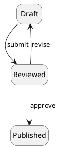
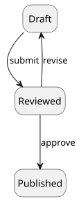

# PlantUML smoke fixture

This fixture keeps the Markdown extraction, secure compilation, and SVG delivery path exercised in CI.

```plantuml
@startuml
hide empty description
state Draft
state Reviewed
state Published
Draft --> Reviewed : submit
Reviewed --> Draft : revise
Reviewed --> Published : approve
@enduml
```

